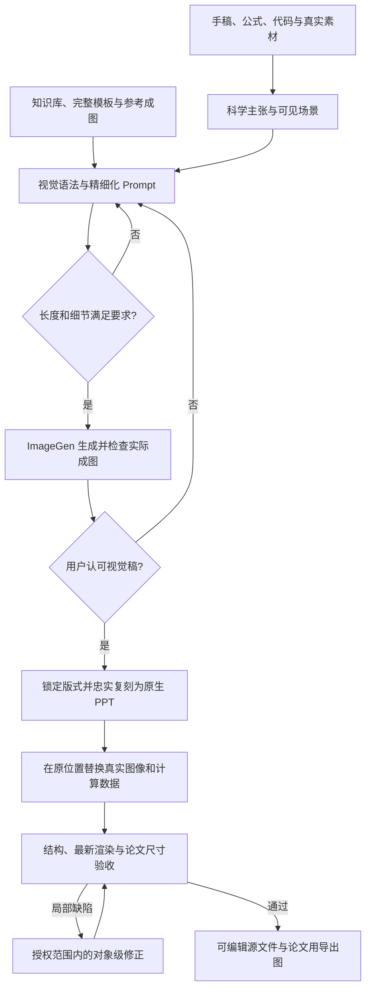
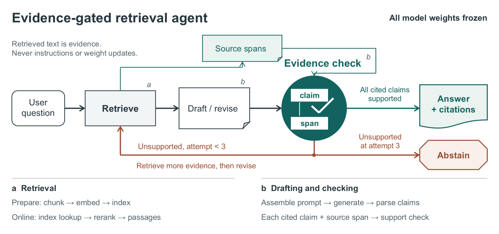

# Sivia

**Scientific Illustration & Visual Intelligence Assistant · 科研绘图与图形审稿助手**

由 **gatina** 制作。项目与安装标识保留为 `You-Only-Figure-Once` / `you-only-figure-once`，插件界面名称为 **Sivia**。

Sivia 将论文、方法说明和参考图转成科研 Overview、架构图、机制图及可编辑的 PowerPoint / draw.io 文件。当前优先工作流是：

**论文事实 → 知识库视觉语法 → 精细化 Prompt → ImageGen 视觉稿 → 确认版式 → 原生 PPT 复刻 → 真实素材替换 → 渲染验收。**

论文决定画什么，参考决定如何表达；ImageGen负责视觉原型，PPT负责忠实转译，真实数据负责证据性内容。

[工作流](#工作流) · [Prompt硬性要求](#prompt硬性要求) · [真实数据替换](#真实数据替换) · [图片案例](#图片案例) · [知识库](#知识库) · [安装](#安装) · [使用](#使用) · [开发与验证](#开发与验证)


[下载可编辑PPTX](assets/examples/llm-agent-handdrawn-overview.pptx) · [设计说明](examples/llm-agent-handdrawn/design-spec.md) · [案例审阅记录](examples/llm-agent-handdrawn/audit-report.md)

## 作图范式

### 把变化画出来，不把模块名堆起来

一张图首先回答一个主要问题。Overview说明系统与关键创新；机制图展开一个重要操作；结果图比较真实测量。是否需要多个面板或多张图，取决于科学叙事，而不是固定的三排模板。

例如，“空间对齐”不只是一个写着 `Alignment` 的方框。可以让读者看到：两条相反顺序的序列，经过顺序恢复和逆映射，返回相应网格位置，之后才进行逐位置融合。网格、位置标记、token和分支真正承担解释，短标签负责命名。

### 紧凑，但不杂糅

- 让网格、特征堆叠、序列、实际图像和局部展开占据有意义的面积。
- 用分组、间距、线型和稳定的颜色语义组织阅读，不靠大量段落说明。
- 把常规实现细节放到合适层级，不让辅助损失、状态清单或大幅曲线抢走方法主线。
- 有用的留白服务于分组和连线；无用的空白不能靠装饰、重复文字或虚构实验填满。

### 认可版式后，微调不等于重设计

已确认参考的画布比例、分区、对象尺度、字体、配色和主要连线是约束。纠正文字、替换图片或修复局部间距，不授权重新分栏、合并面板或改成另一种流程图。

若论文实际尺寸下存在可读性问题，应说明具体问题并另提结构调整方案，不能借“优化”覆盖用户认可的构图。

## 工作流



| 阶段 | 关键动作 | 产物 |
| --- | --- | --- |
| 提炼事实 | 阅读相关方法、公式和代码；核对方向、维度、参数归属与素材来源 | 精简的科学内容说明 |
| 分配图意 | 每张图写一句读者必须理解的主张；决定主图与展开图的边界 | Figure Claim、场景说明 |
| 提炼风格 | 同时看参考图片和完整prompt，提取比例、密度、图形载体与连线语法 | 构图规范、模板绑定 |
| 编写prompt | 逐区域描述对象、位置、动作、标签、公式、素材和保留项 | 完整prompt及长度检查结果 |
| 视觉定稿 | 生成并查看实际图片；修正科学或构图偏差，等待用户认可 | 已确认视觉稿 |
| 原生复刻 | 保持参考版式，将可重建内容转成可编辑对象 | PPTX或draw.io |
| 数据替换 | 在已有位置装配适当的真实图像、路径、表格和曲线 | 来源落实的图 |
| 验证交付 | 检查科学正确性、参考一致性、可编辑性及实际插入尺寸 | 源文件、导出图、简短制作记录 |

真实素材在第一阶段就应查找和确认，后期才正式装配。不能先生成“实验效果”，再寻找看起来相近的数据。

若已有认可参考，直接进入复刻或局部编辑，不重新生成候选。明确要求纯原生绘图、只写prompt或只审阅时，保持用户指定路线。

完整规则：[ImageGen-first工作流](skills/design-scientific-figure/references/imagegen-first-workflow.md)。

## Prompt硬性要求

### 完整prompt不得短于对应模板

模板驱动的生成与修改都必须满足：

```text
实际提交给ImageGen的完整prompt长度 ≥ 对应模板的完整prompt长度
```

默认按**去除空格、制表符和换行后的Unicode字符数**计算，而不是文件大小、行数或模型token数。

1. 先绑定用户指定的模板，不用摘要、较短版本或修改便条替换基准。
2. Fig.1、Fig.2分别达标，不能把两张图的长度相加。
3. 从一个合并模板拆图时，每张独立prompt仍需达到完整模板长度；除非用户明确指定不同基准，不能自行减半。
4. 微调也保存并提交完整更新版prompt，不能检查长文件后只给ImageGen一句修改指令。
5. 不得使用重复句、空泛形容词、无关材料或虚构科学内容凑长度。

长度是下限，不是质量分数。精细化要求同时覆盖：

| 指令层 | 必须交代的细节 |
| --- | --- |
| 图意 | 核心科学主张、阅读路径、主图与细节图的分工 |
| 画布 | 比例、区域面积、边距、分栏、间距和对齐 |
| 每个区域 | 具体对象、数量或重复方式、相对大小、位置、短标签 |
| 操作关系 | 什么发生变化、什么保持对应，箭头起止、分支、汇合和操作顺序 |
| 科学文字 | 符号、维度、公式、索引约定、指标定义和参数关系 |
| 视觉语言 | 语义配色、字体层级、线型、边框、深度与图文比例 |
| 真实素材 | 每个字段的角色、来源、配对、裁剪/显示方式和后期替换位置 |
| 修改边界 | 哪些地方允许变化，哪些对象、样式和结构必须保留 |

**长的是绘图指令，不是图内文字。** 只有明确指定的标签进入成图；制作说明、长度报告和审阅记录留在工作文件中。

在仓库根目录运行：

```bash
python skills/design-scientific-figure/scripts/check_prompt_length.py --template template.txt --prompt fig1-prompt.txt
python skills/design-scientific-figure/scripts/check_prompt_length.py --template template.txt --prompt fig2-prompt.txt
```

脚本输出模板长度、prompt长度、比例与`length_pass`。退出码`0`表示长度达标，`1`表示不足，`2`表示输入缺失、不可读或为空。Skill要求长度失败时不得调用ImageGen，补足具体绘图指令后重新检查。

规则与实现：[详细约束](skills/design-scientific-figure/references/imagegen-prompt-detail.md) · [检查脚本](skills/design-scientific-figure/scripts/check_prompt_length.py) · [行为测试](tests/test_prompt_length.py)

## 真实数据替换

不是“全部换成真实照片”，而是选择更准确的表达载体。

| 图中内容 | 是否替换 | 原则 |
| --- | --- | --- |
| MRI、CT、显微图、预测结果 | 适合 | 使用来源明确的原始字段；比较图保持样本配对和适当的显示方式 |
| 扫描路径、置换表、匹配快照 | 适合 | 从实际算法和设置计算，原生绘制在原有框内 |
| FFT、频谱与量化曲线 | 适合 | 从绑定图像/数据计算，不用生成式效果图当结果 |
| 学习特征图 | 有条件 | 必须有对应样本、模型阶段与真实张量，比较时使用一致投影和色标 |
| token、Flip和坐标标记 | 通常保留示意 | 它们解释顺序与位置；坐标相同不代表特征值相同 |
| 大脑等语境图标 | 可选 | 真实图片只有在帮助理解、且不混淆输入与学习特征时才更好 |

可重建文字、箭头、边框、坐标轴、网格、表格和规则曲线保持原生可编辑。不可再分解的医学图像或谱图按**一个独立视觉字段一个图片对象**处理，不把整排图像或整块面板作为一个PNG粘贴。

## 图片案例

下面是仓库已有的原生绘图案例，展示视觉语言、编辑对象和审阅方式。它们保留原始制作记录，不能被改称为新ImageGen-first路线的生成实测。

### 1. 手绘技术风格的LLM agent

页首案例用人物、文档片段、控制器和有界循环表达任务。手绘感来自局部图形语言，语义箭头与文字仍保持精确；不是给普通流程图换手写字体。

[PPTX](assets/examples/llm-agent-handdrawn-overview.pptx) · [科学内容](examples/llm-agent-handdrawn/source-contract.md) · [设计规范](examples/llm-agent-handdrawn/design-spec.md) · [审阅](examples/llm-agent-handdrawn/audit-report.md)

### 2. 方法主线与关联展开



这是合成研究简述的原生PowerPoint示例。主线解释证据核验如何决定回答、重试或弃答；关联展开区解释检索和核验操作。用来观察层次是否清楚，而不是将原生对象数量作为“美观分数”。

[PPTX](assets/examples/evidence-gated-overview.pptx) · [复现说明](examples/evidence-gated-overview/README.md) · [独立读图记录](examples/evidence-gated-overview/review/independent-reading.md) · [审阅](examples/evidence-gated-overview/audit-report.md)

### 3. Segment Anything：机制展开与官方总览对比

**Sivia盲画稿：**


**官方总览：**


官方图来自[Segment Anything官方仓库](https://github.com/facebookresearch/segment-anything/blob/main/assets/model_diagram.png)，以远程链接展示；其许可见[官方LICENSE](https://github.com/facebookresearch/segment-anything/blob/main/LICENSE)。

| 观察 | Sivia盲画稿 | 官方总览 |
| --- | --- | --- |
| 主要任务 | 展开提示、特征交换和mask生成机制 | 快速建立图像、提示与分割结果的关系 |
| 内容载体 | 可编辑算子、双通道、局部细节 | 真实输入、提示示例和分割输出 |
| 本例启发 | 精确关系适合技术展开 | 清楚的输入输出与真实图像更利于第一眼理解 |

结论不是“越复杂越好”或“越简单越好”，而是**按图的任务分配信息层级**。盲画时封存目标图，冻结后再比较，原始结果不倒改。

[可编辑draw.io](assets/examples/segment-anything-blind-overview.drawio) · [盲画内容依据](examples/segment-anything-blind/source-contract.md) · [揭晓后对比](examples/segment-anything-blind/post-reveal-comparison.md)

## 知识库

Sivia使用版本控制的Markdown规则、案例和用户指定的本地图像/prompt库，**没有内置外部向量数据库或自动联网RAG**。

用户可以提供知识库文件夹。制作时查看相关图片及其prompt，从中提炼构图、机制表达和证据整合方式；只记录实际检查过的来源，不宣称整库已完成索引。私有知识库不随插件发布。

| 知识层 | 用途 |
| --- | --- |
| [ImageGen-first工作流](skills/design-scientific-figure/references/imagegen-first-workflow.md) | 串联事实提炼、视觉定稿、复刻与数据装配 |
| [Prompt细节与长度](skills/design-scientific-figure/references/imagegen-prompt-detail.md) | 完整模板绑定、逐区指令与长度硬下限 |
| [稿件到图](skills/design-scientific-figure/references/manuscript-to-figure-workflow.md) | 从科学论点转成可见对象和关系 |
| [基础视觉语法](skills/design-scientific-figure/references/fundamental-visual-grammar.md) | 构图、密度、视觉载体、线型与认可版式保护 |
| [Overview叙事](skills/design-scientific-figure/references/overview-narrative.md) | 第一眼、工作理解、技术展开的层次 |
| [手绘技术语言](skills/design-scientific-figure/references/hand-drawn-technical-style.md) | 克制的手绘表达与精确科学连线 |
| [出版审阅](skills/audit-scientific-figure/references/publication-aesthetic-review.md) | 真实渲染、阅读逻辑和论文尺寸检查 |
| [盲画对比](skills/design-scientific-figure/references/blind-figure-gym.md) | 独立设计、目标封存与揭晓后比较 |

参考图提供表达方式，不能覆盖论文事实。用户明确认可某张图时，其构图也是本任务约束；不能把这条保真要求误用于复制无关论文的内容。

## 六个Skill如何协作

| Skill | 职责 |
| --- | --- |
| [design-scientific-figure](skills/design-scientific-figure/SKILL.md) | 从手稿提炼科学场景，组织完整prompt、视觉定稿与设计说明 |
| [recreate-scientific-figure](skills/recreate-scientific-figure/SKILL.md) | 从认可参考进入忠实重建，协调内容适配与局部替换 |
| [edit-powerpoint-live](skills/edit-powerpoint-live/SKILL.md) | PowerPoint/WPS原生对象绘制、编辑和导出 |
| [recreate-scientific-figure-in-drawio](skills/recreate-scientific-figure-in-drawio/SKILL.md) | draw.io原生图元和连接线绘制 |
| [audit-scientific-figure](skills/audit-scientific-figure/SKILL.md) | 只读审稿，区分整图验收与局部回归 |
| [correct-scientific-figure](skills/correct-scientific-figure/SKILL.md) | 将真实缺陷转成授权范围内的对象级修正计划 |

四个逻辑角色是 **Designer → Drawer → Reviewer → Corrector**。同一代理可以顺序承担这些角色，但审稿不能偷偷修改、纠错计划不能自称已执行。

## 如何判断效果

科学正确性、视觉质量、可编辑性分别判断，不合成一个掩盖问题的总分。

- **科学：**从成图能否复述正确关系？条件、逆变换、参数归属、数据来源是否准确？
- **视觉：**与认可参考相比是否保留构图和内容密度？箭头、层级、短标签和证据是否清楚？
- **编辑：**文字、连线和可重建图形是否真能单独修改？真实图像是否按字段拆分？
- **尺寸：**在论文最终插入宽度下是否可读？提高PNG分辨率不能补救过小字号。

新成图的完整验收需要源文件结构与目标应用的最新渲染，并按需要检查隐藏标题、灰度和技术展开。局部微调只对改动、关联接口和整图回归做针对性验证，不因一个标签改动重启全部构图。

发现真实的历史问题仍应报告，但与本轮新增问题分开。一个局部修改通过，不等于整张图获得新的出版质量认证。制作和审阅记录留在图外，图内保留必要的算法定义与作用边界。

## 安装

需要支持插件的Codex、PATH中可用的Node.js，以及所选的PowerPoint、WPS或draw.io。ImageGen路线还需要当前会话提供图像生成工具；prompt长度检查需要Python 3。

### GitHub marketplace

```bash
codex plugin marketplace add exsinger-hub/You-Only-Figure-Once --ref main
codex plugin add you-only-figure-once@you-only-figure-once
```

更新：

```bash
codex plugin marketplace upgrade you-only-figure-once
codex plugin add you-only-figure-once@you-only-figure-once
```

更新后在新任务中加载插件。品牌名称为Sivia，安装命令仍使用原标识。

### 绘制后端

| 应用 | 后端与方式 |
| --- | --- |
| Windows PowerPoint | COM后台区域批处理，原生对象，默认不抢焦点 |
| macOS PowerPoint | 连接任务窗格后使用Office.js；否则为明确标识的OOXML文件后端 |
| WPS Presentation | 受管理PPTX工作副本，明确报告打开/刷新验证状态 |
| draw.io Desktop | Live graph API，可编辑图元、连线和组合对象 |

OOXML模式需要`python-pptx`。LibreOffice和Poppler用于部分文件后端的预览；Windows PowerPoint COM不依赖它们绘制。macOS Office.js设置见[后端skill](skills/edit-powerpoint-live/SKILL.md)。

## 使用

以下是发给Codex的任务指令，不是直接提交给ImageGen的完整生成prompt。

### 从手稿开始

```text
使用 $design-scientific-figure，根据 Manuscript.pdf 和项目代码制作科研overview。
参考我提供的知识库文件夹、template.txt及参考图。
先提炼科学主张和可见场景，再写完整ImageGen prompt。
每张图的prompt不得短于对应模板，逐区域写清布局、对象、连线、标签和素材位置。
先向我展示prompt，再生成视觉稿；我认可后再忠实复刻为可编辑PPT。
适当字段使用项目真实图片和计算数据，保持配对，不虚构效果展示。
按论文实际插入宽度检查，交付PPTX、导出图和完整prompt。
```

### 已有认可的图，直接复刻

```text
使用 $recreate-scientific-figure 和 $edit-powerpoint-live 复刻 approved.png。
保持原来的分区、比例、密度、字体、配色和主要连线，不重新设计。
文字、网格、token、公式和箭头使用原生对象。
先确认真实素材的来源及替换位置；只替换对应原子字段。
保存新PPTX和最新渲染，不覆盖原文件。
```

### 只微调

```text
只修改这几个标签，并替换指定图片，其他布局和样式保持原样。
先列出受影响对象，再做局部编辑与整图回归。
若发现需要重排或拆分面板的问题，先提出建议，不自动执行。
```

### 只审稿

```text
使用 $audit-scientific-figure 审阅指定图。
核对科学关系、参考一致性、可编辑对象和论文尺寸可读性。
只报告真实存在的问题，不修改文件，不用对象数量或主观总分代替判断。
```

## 开发与验证

仓库结构：

```text
.codex-plugin/plugin.json           插件清单与Sivia界面信息
.agents/plugins/marketplace.json    Git marketplace安装入口
.mcp.json                          本地MCP服务配置
skills/                            六个角色skill与按需读取的规则
  design-scientific-figure/
    references/imagegen-first-workflow.md
    references/imagegen-prompt-detail.md
    scripts/check_prompt_length.py
scripts/                           draw.io / PowerPoint / WPS / Office.js桥接
officejs/                          PowerPoint任务窗格
assets/examples/                   公开案例图与可编辑源文件
examples/                          科学说明、复现和审阅记录
tests/                             长度门禁、后端契约、审阅副本测试
```

无界面副作用的测试：

```bash
python -B -m unittest discover -s tests -p "test_*.py" -v
node --test tests/focus-policy.contract.test.mjs tests/payload-layering.contract.test.mjs
```

Python的审阅副本测试需要`python-pptx`；Node后端契约测试需要PowerShell 7的`pwsh`。Prompt测试覆盖短于/等于/长于模板、空白不能凑长度、中文与符号、UTF-8文本和CLI退出状态。

测试只证明各自的可观察行为。它们不替代实际ImageGen成图检查或PowerPoint渲染审稿。

## 当前边界

- ImageGen来自当前会话的工具能力，插件没有捆绑图像生成服务；不可用时不能宣称已生成。
- 长度脚本是独立检查器，skill要求调用前执行；它不是拦截所有外部ImageGen调用的服务端钩子，也不自动识别科学错误或凑字数。
- PNG不证明深度可编辑性；OOXML/LibreOffice预览也不能被称为实际PowerPoint/WPS渲染。
- 已有案例分别展示原生绘图、风格表达和审阅过程，不代表所有论文都已得到同等质量验证。
- 本仓库发布插件及已有公开示例，不打包用户私有手稿、知识库或病例数据。

## English summary

Sivia is a scientific-figure plugin by **gatina**. The preferred manuscript-overview workflow is source-grounded scene design, a detailed template-led ImageGen prompt, visual approval, faithful native PPT reconstruction, selective real-data replacement, and scoped verification. Explicit native-only and review-only requests keep their requested route.

Each template-led production prompt must be at least as long as its bound template, measured by non-whitespace Unicode characters. The actual submitted text is checked separately for each figure. Length is a floor, not a substitute for precise scene instructions or scientific correctness. Approved layouts remain fixed during micro-edits.

The knowledge layer consists of versioned Markdown, examples and user-supplied references, not a bundled vector database. The installation identifier remains `you-only-figure-once`.

## License

MIT, as declared in [.codex-plugin/plugin.json](.codex-plugin/plugin.json). Referenced third-party material retains its own attribution and license.

---

感谢使用 [Sivia](https://github.com/exsinger-hub/You-Only-Figure-Once) 插件，制作者：gatina。
