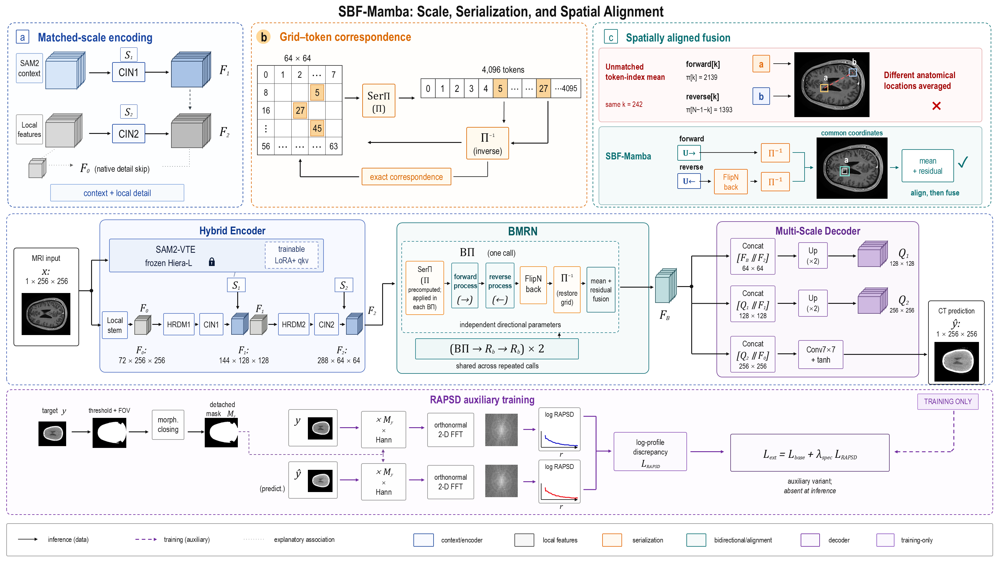
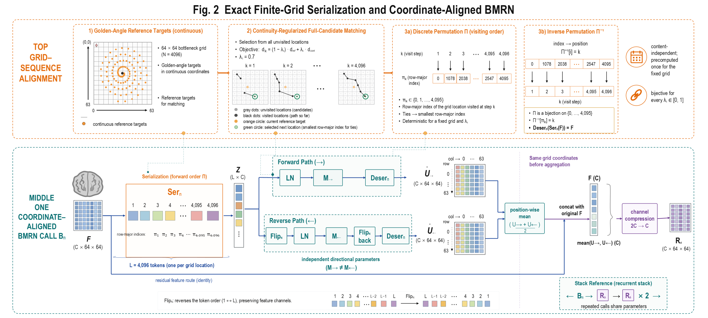

# Sivia

[**Sivia**](https://github.com/exsinger-hub/You-Only-Figure-Once) 是一款科研绘图插件。提供论文和作图需求，Sivia 会先理解研究问题、核心方法与创新点，再将论文内容组织成清晰、紧凑的科研 Overview，并制作可编辑的 PowerPoint。

## 使用

上传论文，或提供手稿与项目文件夹，直接告诉 Codex：

```text
使用 Sivia 阅读这篇论文，理解研究问题、核心方法和创新点，
为论文绘制一张突出核心贡献的科研 Overview，最终提供可编辑的 PowerPoint。
```

如有偏好的参考图、重点内容或已认可的版式，一并提供即可。无需自己写 ImageGen 提示词或指定内部流程。

## SBF-Mamba作图示例

### Fig.1 · 方法总览

多尺度编码、序列化、空间对齐融合与辅助频谱训练，结合真实医学图像展示。



### Fig.2 · 核心机制

有限网格序列化与坐标对齐的双向建模。



## 工作流

1. **理解论文**：读懂研究问题与方法逻辑，选择值得展示的核心贡献，转化为可见的科学场景。
2. **设计并确认**：结合内置模板与参考图编写详细提示词，通过 ImageGen 生成视觉稿，交由你确认。
3. **忠实复刻**：按认可版式重建原生PPT，文字、图形、网格和连线保持可编辑。
4. **真实素材替换**：使用对应图像和计算数据替换合适字段，检查后导出。

模板选择、逐区域提示词编写与“不短于模板”的检查由插件内部完成；已认可的版式不擅自重设计。

[内置模板](skills/design-scientific-figure/references/prompt-templates.md) · [详细工作流](skills/design-scientific-figure/references/imagegen-first-workflow.md)

## 安装

需要Codex、Node.js及所选的PowerPoint、WPS或draw.io；ImageGen路线需要会话提供图像生成工具，prompt长度检查需要Python 3。

```bash
codex plugin marketplace add exsinger-hub/You-Only-Figure-Once --ref main
codex plugin add you-only-figure-once@you-only-figure-once
```

## 致谢

Sivia 基于 [Scientific Illustrator](https://github.com/icebird1998/scientific-illustrator) 改造与扩展。感谢原作者 **一个地质博士（icebird1998）** 提供的可编辑科研绘图基础、PowerPoint / WPS / draw.io 后端，以及设计、绘制、审阅、修正的协作流程。Sivia 在此基础上扩展了论文理解、模板化 ImageGen 设计和视觉稿忠实复刻工作流。保留原项目的 [MIT 许可证与版权声明](LICENSE)。

---

感谢使用 [Sivia](https://github.com/exsinger-hub/You-Only-Figure-Once) 插件，制作者：gatina。
