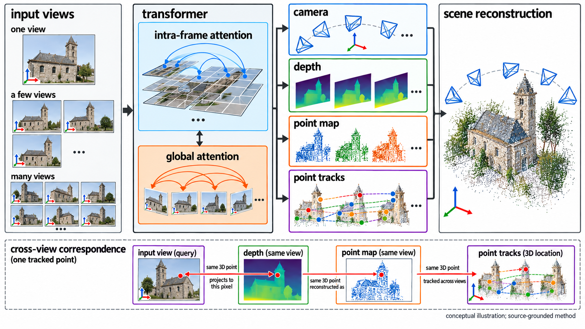
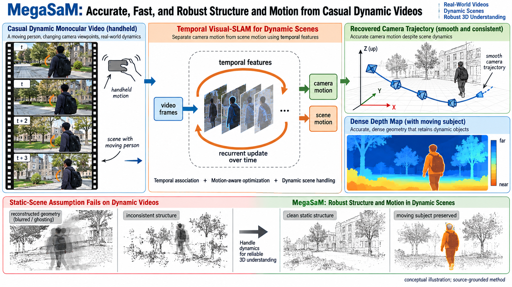
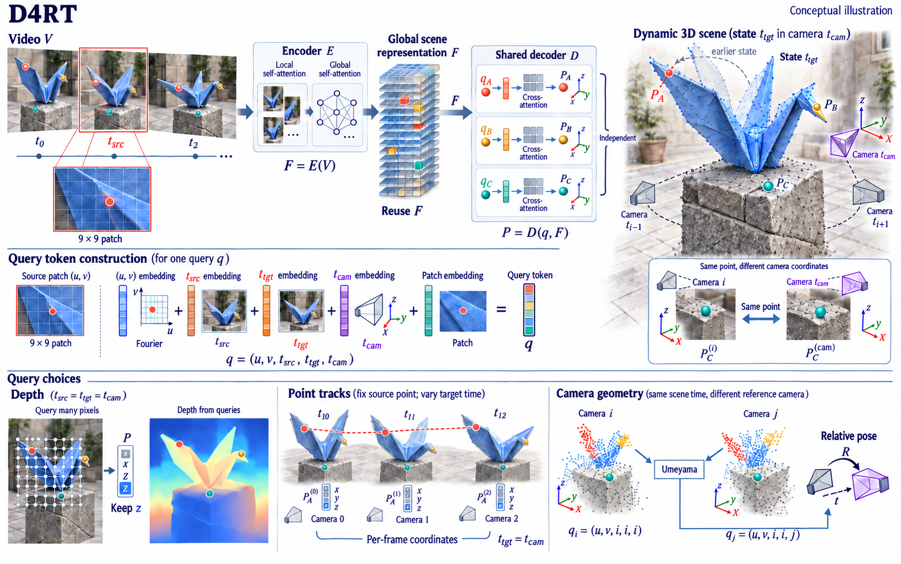
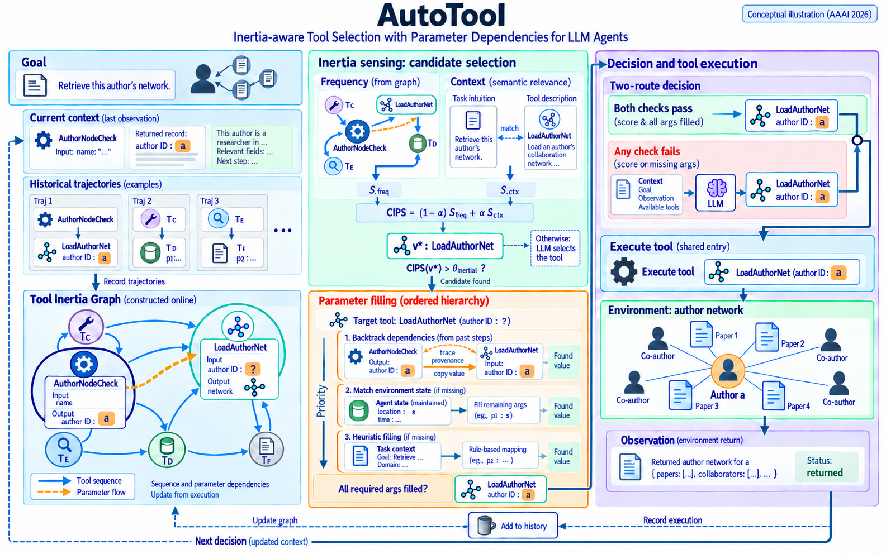
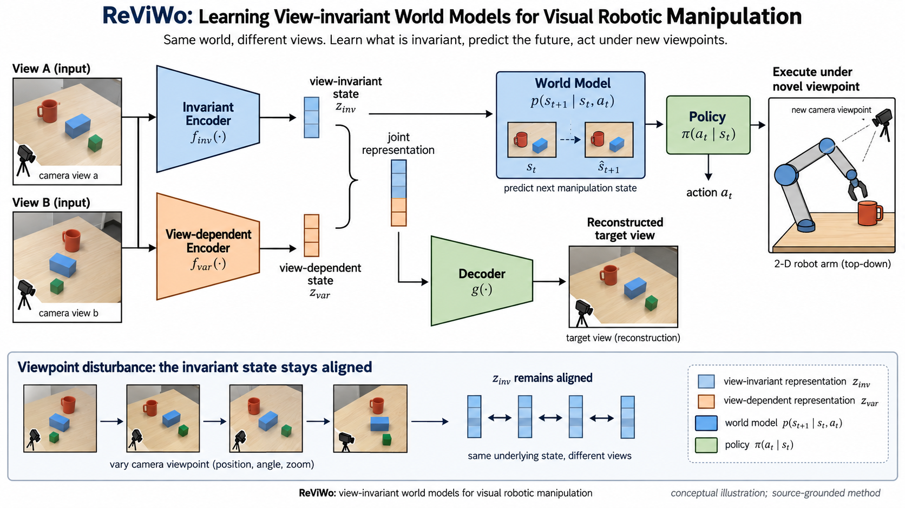
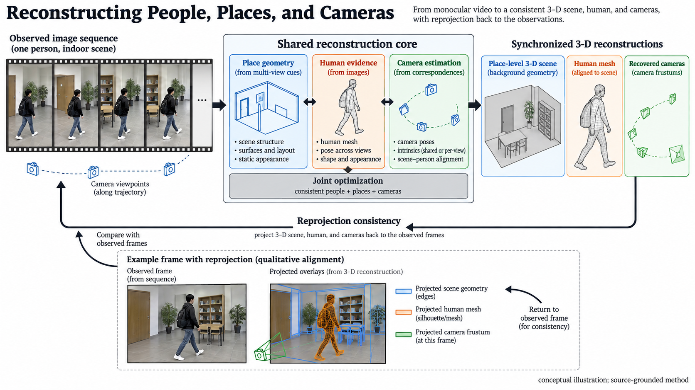
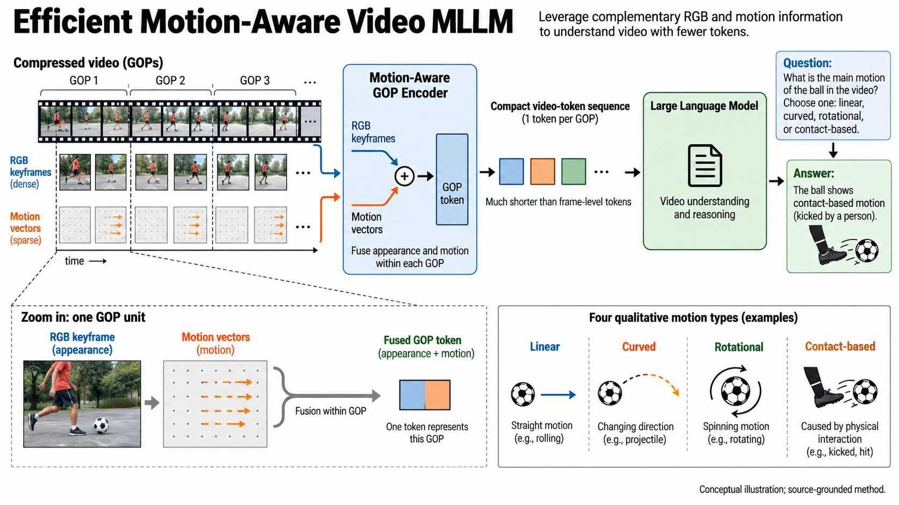
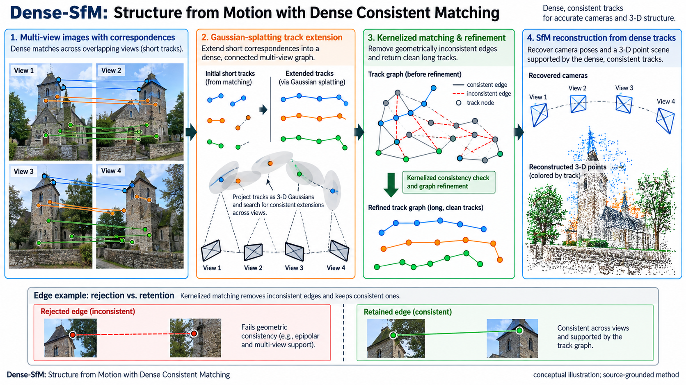

<div align="center">

# Sivia

### Paper → Scientific Overview → Editable PowerPoint

**Turn the method in your paper into a PowerPoint figure you can keep editing.**

[](.codex-plugin/plugin.json)
[](#installation)
[](LICENSE)

English | [简体中文](README_ZH.md)

[Knowledge base & gallery](#knowledge-base) · [Quick start](#quick-start) · [RSI](#rsi) · [Installation](#installation)

</div>

Sivia is a scientific-figure plugin for **Codex and Claude Code**, built for method illustrations in papers, lab meetings and thesis defenses. Give it a paper: Sivia maps the method and contribution, draws on an **extensible external knowledge base**, and generates an overview. After you approve the design and request the PowerPoint, it delivers an **editable PPTX** for **PowerPoint or WPS**.

Keep editing the result: change labels, move modules, adjust arrows and replace experiment images. Adapt the same method figure to a paper layout or a presentation.

| Capability | What you can do with it |
| --- | --- |
| **Editable PowerPoint delivery** | Work with native text, modules and arrows, with complex artwork and experiment images kept as separate assets. |
| **External knowledge base** | Draw on examples matched by domain, scientific objects, method relationships and composition, including your own lab references. |
| **Local revisions and reusable experience** | Revise the requested region while preserving approved layout choices; retain accepted cases and useful feedback for later work. |

**Delivery: Paper → Overview preview → Approval and PowerPoint request → Editable PPTX + preview.**

Sivia also reconstructs existing scientific figures and supports editable draw.io output. Its [RSI](#rsi) research direction explores how drawing skills and the methods used to improve them can evolve over time.

## Knowledge base

**Connect your drawing workflow to an extensible external knowledge base.** Sivia ships with curated scientific-figure examples and can also use reference figures, lab styles and approved work you supply. These references guide composition, hierarchy, spatial relationships and visual expression; the current paper determines the scientific content.

The library contains **10 approved cases** across the five areas below, alongside **3 separately marked review drafts**. The gallery shows overview images, with production records and source notes available for each case.

[Browse the classified knowledge base](knowledge-base/README.md) · [Extend the case library](knowledge-base/CONTRIBUTING.md)

### 3D reconstruction and dynamic geometry

<table>
<tr>
<td width="50%" valign="top" align="center">
<strong>Neuralangelo: High-Fidelity Neural Surface Reconstruction</strong><br>
<sub>User-selected / active</sub><br>
<a href="knowledge-base/cases/neuralangelo/figure.png"></a><br>
<a href="knowledge-base/cases/neuralangelo/figure.png">Full-size image</a> · <a href="knowledge-base/cases/neuralangelo/prompt.txt">Production record</a> · <a href="knowledge-base/cases/neuralangelo/README.md">Case details</a>
</td>
<td width="50%" valign="top" align="center">
<strong>VGGT: Visual Geometry Grounded Transformer</strong><br>
<sub>User-selected / active</sub><br>
<a href="knowledge-base/overview-hot-domains-2025-26/pairs/cvpr25-vggt/figure.png"></a><br>
<a href="knowledge-base/overview-hot-domains-2025-26/pairs/cvpr25-vggt/figure.png">Full-size image</a> · <a href="knowledge-base/overview-hot-domains-2025-26/pairs/cvpr25-vggt/prompt.txt">Production record</a> · <a href="knowledge-base/overview-hot-domains-2025-26/pairs/cvpr25-vggt/README.md">Case details</a>
</td>
</tr>
<tr>
<td width="50%" valign="top" align="center">
<strong>MegaSaM: Accurate, Fast, and Robust Structure and Motion from Casual Dynamic Videos</strong><br>
<sub>User-selected / active</sub><br>
<a href="knowledge-base/overview-hot-domains-2025-26/pairs/cvpr25-megasam/figure.png"></a><br>
<a href="knowledge-base/overview-hot-domains-2025-26/pairs/cvpr25-megasam/figure.png">Full-size image</a> · <a href="knowledge-base/overview-hot-domains-2025-26/pairs/cvpr25-megasam/prompt.txt">Production record</a> · <a href="knowledge-base/overview-hot-domains-2025-26/pairs/cvpr25-megasam/README.md">Case details</a>
</td>
<td width="50%" valign="top" align="center">
<strong>D4RT</strong><br>
<sub>Review draft · not admitted</sub><br>
<a href="knowledge-base/restart-2026/pairs/d4rt/figure.png"></a><br>
<a href="knowledge-base/restart-2026/pairs/d4rt/figure.png">Full-size image</a> · <a href="knowledge-base/restart-2026/pairs/d4rt/prompt.txt">Production record</a> · <a href="knowledge-base/restart-2026/pairs/d4rt/README.md">Case details</a>
</td>
</tr>
</table>

### Agents, tools and retrieval

<table>
<tr>
<td width="50%" valign="top" align="center">
<strong>ReAct: Synergizing Reasoning and Acting in Language Models</strong><br>
<sub>User-selected / active</sub><br>
<a href="knowledge-base/cases/react/figure.png"></a><br>
<a href="knowledge-base/cases/react/figure.png">Full-size image</a> · <a href="knowledge-base/cases/react/prompt.txt">Production record</a> · <a href="knowledge-base/cases/react/README.md">Case details</a>
</td>
<td width="50%" valign="top" align="center">
<strong>AutoTool</strong><br>
<sub>Review draft · not admitted</sub><br>
<a href="knowledge-base/restart-2026/pairs/autotool/figure.png"></a><br>
<a href="knowledge-base/restart-2026/pairs/autotool/figure.png">Full-size image</a> · <a href="knowledge-base/restart-2026/pairs/autotool/prompt.txt">Production record</a> · <a href="knowledge-base/restart-2026/pairs/autotool/README.md">Case details</a>
</td>
</tr>
</table>

### Molecular modeling and AI for Science

<table>
<tr>
<td width="50%" valign="top" align="center">
<strong>DiffDock: Diffusion Steps, Twists, and Turns for Molecular Docking</strong><br>
<sub>User-selected / active</sub><br>
<a href="knowledge-base/cases/diffdock/figure.png"></a><br>
<a href="knowledge-base/cases/diffdock/figure.png">Full-size image</a> · <a href="knowledge-base/cases/diffdock/prompt.txt">Production record</a> · <a href="knowledge-base/cases/diffdock/README.md">Case details</a>
</td>
<td width="50%" valign="top" align="center">
<strong>SigmaDock</strong><br>
<sub>Review draft · not admitted</sub><br>
<a href="knowledge-base/restart-2026/pairs/sigmadock/figure.png"></a><br>
<a href="knowledge-base/restart-2026/pairs/sigmadock/figure.png">Full-size image</a> · <a href="knowledge-base/restart-2026/pairs/sigmadock/prompt.txt">Production record</a> · <a href="knowledge-base/restart-2026/pairs/sigmadock/README.md">Case details</a>
</td>
</tr>
</table>

### World models and embodied perception

<table>
<tr>
<td width="50%" valign="top" align="center">
<strong>Learning View-invariant World Models for Visual Robotic Manipulation</strong><br>
<sub>User-selected / active</sub><br>
<a href="knowledge-base/overview-hot-domains-2025-26/pairs/iclr25-reviwo/figure.png"></a><br>
<a href="knowledge-base/overview-hot-domains-2025-26/pairs/iclr25-reviwo/figure.png">Full-size image</a> · <a href="knowledge-base/overview-hot-domains-2025-26/pairs/iclr25-reviwo/prompt.txt">Production record</a> · <a href="knowledge-base/overview-hot-domains-2025-26/pairs/iclr25-reviwo/README.md">Case details</a>
</td>
<td width="50%" valign="top" align="center">
<strong>RoboSpatial: Teaching Spatial Understanding to 2D and 3D Vision-Language Models for Robotics</strong><br>
<sub>User-selected / active</sub><br>
<a href="knowledge-base/overview-hot-domains-2025-26/pairs/cvpr25-robospatial/figure.png"></a><br>
<a href="knowledge-base/overview-hot-domains-2025-26/pairs/cvpr25-robospatial/figure.png">Full-size image</a> · <a href="knowledge-base/overview-hot-domains-2025-26/pairs/cvpr25-robospatial/prompt.txt">Production record</a> · <a href="knowledge-base/overview-hot-domains-2025-26/pairs/cvpr25-robospatial/README.md">Case details</a>
</td>
</tr>
<tr>
<td width="50%" valign="top" align="center">
<strong>Reconstructing People, Places, and Cameras</strong><br>
<sub>User-selected / active</sub><br>
<a href="knowledge-base/overview-hot-domains-2025-26/pairs/cvpr25-people-places-cameras/figure.png"></a><br>
<a href="knowledge-base/overview-hot-domains-2025-26/pairs/cvpr25-people-places-cameras/figure.png">Full-size image</a> · <a href="knowledge-base/overview-hot-domains-2025-26/pairs/cvpr25-people-places-cameras/prompt.txt">Production record</a> · <a href="knowledge-base/overview-hot-domains-2025-26/pairs/cvpr25-people-places-cameras/README.md">Case details</a>
</td>
<td width="50%" valign="top" align="center"></td>
</tr>
</table>

### Multimodal and motion-aware learning

<table>
<tr>
<td width="50%" valign="top" align="center">
<strong>Efficient Motion-Aware Video MLLM</strong><br>
<sub>User-selected / active</sub><br>
<a href="knowledge-base/overview-hot-domains-2025-26/pairs/cvpr25-motion-aware-video-mllm/figure.png"></a><br>
<a href="knowledge-base/overview-hot-domains-2025-26/pairs/cvpr25-motion-aware-video-mllm/figure.png">Full-size image</a> · <a href="knowledge-base/overview-hot-domains-2025-26/pairs/cvpr25-motion-aware-video-mllm/prompt.txt">Production record</a> · <a href="knowledge-base/overview-hot-domains-2025-26/pairs/cvpr25-motion-aware-video-mllm/README.md">Case details</a>
</td>
<td width="50%" valign="top" align="center">
<strong>Dense-SfM: Structure from Motion with Dense Consistent Matching</strong><br>
<sub>User-selected / active</sub><br>
<a href="knowledge-base/overview-hot-domains-2025-26/pairs/cvpr25-dense-sfm/figure.png"></a><br>
<a href="knowledge-base/overview-hot-domains-2025-26/pairs/cvpr25-dense-sfm/figure.png">Full-size image</a> · <a href="knowledge-base/overview-hot-domains-2025-26/pairs/cvpr25-dense-sfm/prompt.txt">Production record</a> · <a href="knowledge-base/overview-hot-domains-2025-26/pairs/cvpr25-dense-sfm/README.md">Case details</a>
</td>
</tr>
</table>

## Quick start

After installation, attach your paper in Codex or Claude Code and describe the figure you need.

### 1. Upload a paper, generate an overview

```text
Use Sivia to create a scientific overview of this paper.
Highlight its contribution, key modules, inputs and outputs in a compact composition for the paper.
```

Sivia handles paper understanding, reference selection, composition and image generation. Review the actual image and decide what to change.

### 2. Approve the design, generate an editable PowerPoint

```text
I approve this overview. Use Sivia to make an editable PPTX with the same layout and content.
Use native objects for text, modules and arrows, and keep artwork and experiment images separate.
```

Receive **PPTX + preview**. Open it in PowerPoint or WPS to adjust wording, module positions and assets. If you already have an approved scientific figure, start here.

### 3. Make a targeted revision

```text
Move the output module from the right to the bottom, reroute its arrows and enlarge the labels.
Preserve the other regions, content and colors. Update the editable PowerPoint and preview.
```

**Bring your own knowledge base:** attach reference figures or provide a case directory, then ask Sivia to use their composition and palette while designing around the current paper's method.

## RSI

**Recursive Self-Improvement · Research direction**

A revision can contribute to the next drawing task. Sivia currently uses a design, drawing, review and correction workflow, and retains approved work, reference assets and useful feedback as local cases that can be reused in later tasks.

The RSI direction studies both **drawing skills** and **the methods that update those skills**: propose rules from revision feedback, evaluate them on new tasks, then explore recursive improvement of the updating strategy itself. The current open-source release provides editable figure production and case accumulation; recursive updater development is a research direction.

## Installation

### Codex

Run in a terminal, then start a new task:

```bash
codex plugin marketplace add exsinger-hub/Sivia --ref main
codex plugin add sivia@sivia
```

### Claude Code

Run inside Claude Code:

```text
/plugin marketplace add exsinger-hub/Sivia
/plugin install sivia@sivia
```

## Development and documentation

[Full workflow](docs/workflow.md) · [Changelog](CHANGELOG.md) · [Contribute to the knowledge base](knowledge-base/CONTRIBUTING.md)

Run checks from the repository root:

```bash
node scripts/sync-plugin-metadata.mjs --check
node --test tests/*.test.mjs
python -m unittest discover -s tests -p "test_*.py"
```

## Acknowledgments

Built on [Scientific Illustrator](https://github.com/icebird1998/scientific-illustrator) by **icebird1998（一个地质博士）**, retaining its [MIT license and copyright](LICENSE). Sivia extends its editable drawing backends and Designer–Drawer–Reviewer–Corrector process with manuscript understanding, template-led ImageGen drafts and approval-locked reconstruction.

The bilingual README navigation and product-oriented organization take inspiration from [CC Switch](https://github.com/farion1231/cc-switch); its product claims and promotional content are not reused.

---

Thank you for using [Sivia](https://github.com/exsinger-hub/Sivia). Created by **gatina**.
