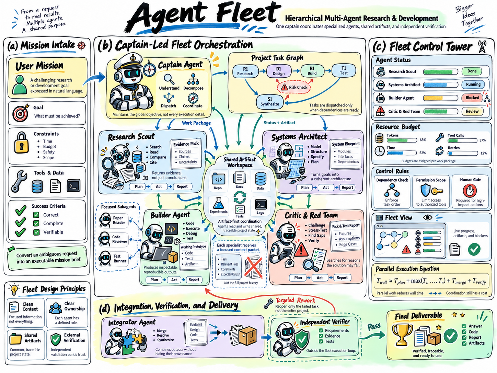
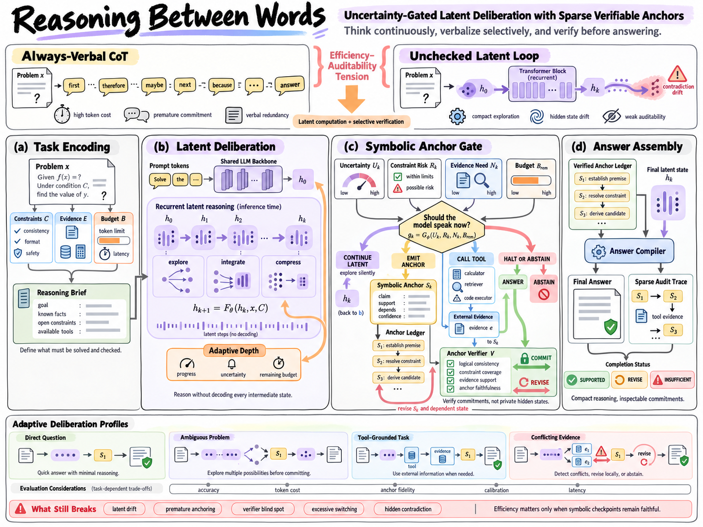
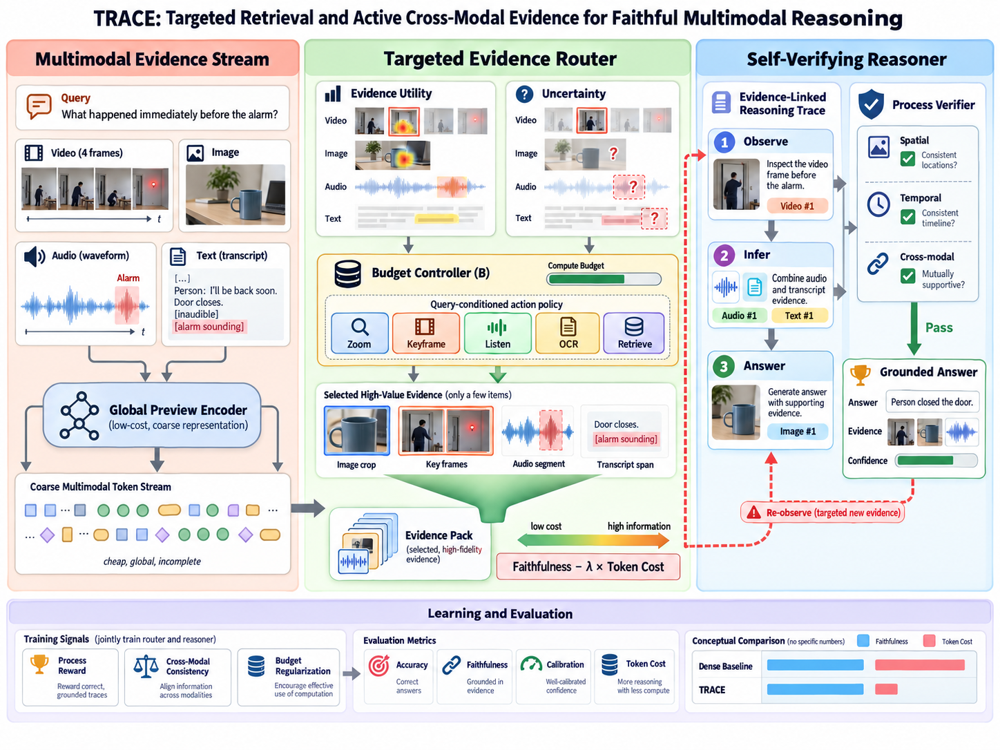
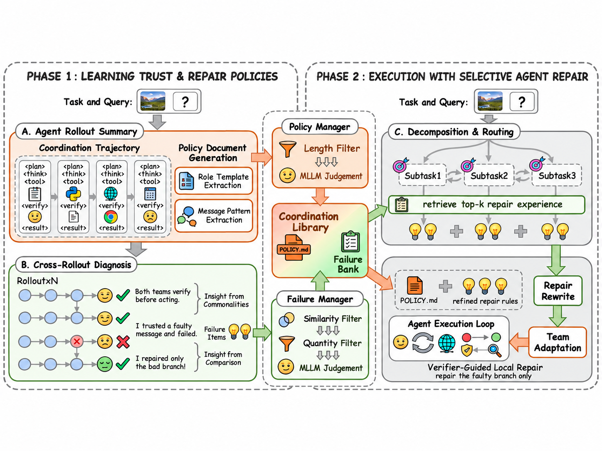
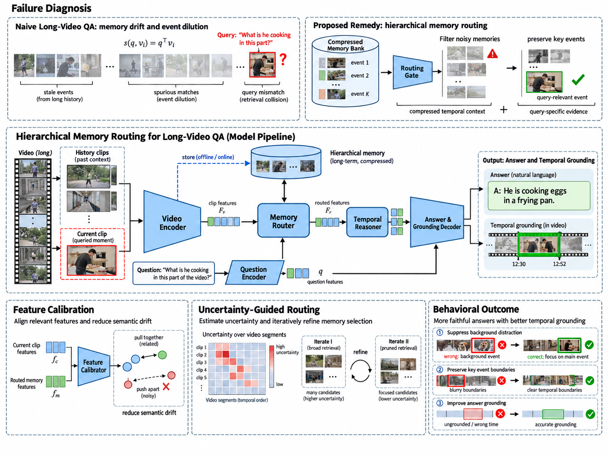

# Sivia

[**Sivia**](https://github.com/exsinger-hub/Sivia) 是面向 Codex 和 Claude Code 的科研绘图插件。输入 PDF 论文，先理解研究内容、参考知识库编写精细 prompt，再生成科研 Overview 图片供你审阅。**默认先交图片，不直接制作 PPT；是否修改图片、是否继续生成可编辑 PPT，由你决定。**

## 安装

仓库地址是 **https://github.com/exsinger-hub/Sivia**。插件标识和插件市场标识均为小写 `sivia`，因此安装选择器是 `sivia@sivia`：前一个是插件名，后一个是市场名，不是另一个 GitHub 地址。

### Claude Code

在 Claude Code 对话内依次执行：

```text
/plugin marketplace add exsinger-hub/Sivia
/plugin install sivia@sivia
```

安装后重新开启会话。上传 PDF，或提供 Claude Code 可访问的本地文件路径，按下文说明开始。也可用 `/sivia:design-scientific-figure` 显式调用绘图设计 skill。安装方式对应 [Claude Code 官方插件说明](https://code.claude.com/docs/en/plugin-marketplaces)。

### Codex

在终端依次执行：

```bash
codex plugin marketplace add exsinger-hub/Sivia --ref main
codex plugin add sivia@sivia
```

第一条注册仓库中的插件市场，第二条安装 Sivia。安装后新开任务使用。市场注册方式见 [OpenAI 官方插件说明](https://developers.openai.com/plugins/build/plugins)；安装命令可用本机 `codex plugin add --help` 核对。若之前安装了旧名插件，请在插件管理中停用旧版，避免同一组 skills 重复加载。

### 运行条件

- **理解论文与编写 prompt**：客户端能够读取 PDF；Python 3 用于检查 prompt 长度。
- **生成图片**：当前会话需要可调用的 ImageGen / 图像生成工具。Sivia 提供工作流、模板和知识库，不内置生图模型或 API 凭据；Claude Code 需另行连接图像生成工具或 MCP 服务。
- **制作可编辑 PPT（可选）**：Node.js，以及可用的 PowerPoint / WPS 后端；具体能力由插件检测。只做图片阶段不需要打开这些软件。

没有可用生图工具时，Sivia 会交付完整 prompt 并说明缺少的能力。你也可以将 prompt 用于 ImageGen，再把成图传回继续审阅；它不会擅自跳过图片确认，直接改用 PPT 绘制。

## 使用

### 1. 从论文设计 Overview 视觉稿

必需材料是 **PDF 论文或完整手稿**。可选材料包括：偏好的参考图、知识库案例、项目代码和真实图片/数据、目标版面尺寸。没有指定模板时，由 Sivia 理解论文后选择合适的内置模板，不要求你自己写生产 prompt。

上传 PDF 后，复制以下提示词。三段示例借鉴 [Scientific Illustrator 的使用提示词](https://github.com/icebird1998/scientific-illustrator#直接复制使用)对任务对象、操作边界、检查方法和交付物的明确约定，并保留 Sivia 的 ImageGen 视觉确认流程。

```text
使用 Sivia，根据我上传的 PDF 论文设计并生成一张用于论文正文的科研方法总览图（Overview）。

先阅读论文，以正文、公式及我提供的项目实现为科学依据，梳理研究问题、已有方法的关键局限、
本文贡献，以及输入、核心处理过程和输出之间的关系。明确本图要传达的核心信息，
区分需要进入主图的内容与适合留在正文的细节；遇到影响方法解释的矛盾，先指出并核实。

再从 Sivia 知识库中选择表达任务相近的成图及其完整 prompt，提炼构图、视觉层级、
图形语言和连线规则。参考图用于借鉴表达方式，不作为本文模型结构、公式或实验数值的来源。
围绕论文自身的方法组织分区和阅读路径，用具体的视觉对象与操作关系解释机制，
使核心贡献成为视觉重点；保持布局紧凑、层级清晰，避免把全文模块机械排列成流程框。

先简述图意与分区安排，再编写完整的 ImageGen 生成 prompt，逐区域明确对象、位置、
相对比例、连接关系、英文标签、配色和排版要求。记录所选模板，并在调用前检查实际提交的
完整 prompt：按非空白字符数计，不得短于该模板。生成说明可以充分展开，图内标签应精炼，
术语与符号须与论文一致；图中不放内部制作说明、审阅记录或待完成事项。

调用 ImageGen 生成视觉稿，检查方法关系、箭头语义、标签准确性与缩放后的可读性。
交付实际生成图片、完整 prompt 和简短设计说明，区分机制示意与需要真实数据支持的字段。
展示图片后询问我的修改意见，以及是否需要制作可编辑 PPT，然后暂停等待回复。
本阶段仅交付图片，不连接 PowerPoint/WPS，不创建或编辑演示文稿。
```

这段是**用户需求示例**，不是直接发给 ImageGen 的完整 prompt。真正的生成 prompt 由 Sivia 根据论文和模板展开、保存，并检查长度。希望先审核文字时，额外说“先只给我完整 prompt，等我确认再生成图片”。

第一轮交付：生成图片、对应完整 prompt、简短的内容与布局说明。缺少项目真实素材不妨碍先讨论构图，但生成的示例不能冒充实验结果。

### 2. 根据审阅意见局部修订视觉稿

将具体修改意见写在以下提示词之后，或附上标注图。修改区域和目标由你的意见决定，不预设某个分区一定要放大或删减。

```text
使用 Sivia，根据我本条消息附带的审阅意见或标注图，对当前 Overview 视觉稿进行局部修订。

以当前图片及其对应的完整 prompt 为修改基线，先明确受影响的区域、对象和关系。
如果没有提供具体修改意见，或标注对象无法确定，先询问，不自行选择修改内容。
保留未涉及的画布比例、分区结构、模块位置、配色和阅读顺序；仅调整指定对象及必要的邻接布局。
若修改必须改变整体结构，先说明原因并征求同意，不将重新设计当作局部修正。

涉及模块含义、数学符号或箭头方向时，对照论文核实；精简文字时保留影响理解的条件与定义。
将修改要求整合进完整的生成 prompt，保留未改区域的约束，按原模板检查长度，
不要用仅描述差异的短指令替代完整 prompt。以当前图片为参考输入，再调用 ImageGen 修订。

对照修改前后的局部区域和整张图，检查目标改动是否落实，以及其他区域是否出现连带变化。
交付修订图片、对应完整 prompt 和逐项修改说明，保留上一版本供比较。
再次展示图片并等待我确认；本阶段不制作或修改 PPT。
```

每次修改都保留对应的完整 prompt 和成图。已认可的部分不擅自重设计。回复“这张图可以”表示认可该图片，**不等于授权制作 PPT**；你也可以只保留图片，到此结束。

### 3. 将已确认视觉稿复刻为可编辑 PPT

确认具体图片版本后，再发送以下指令。需要 WPS 时请明确写“目标软件为 WPS 演示”；若未指定软件，由插件报告可用后端，并在不满足后台要求时暂停。

```text
使用 Sivia，将我明确确认的 Overview 视觉稿忠实复刻为可编辑 PPTX。

先确认参考图片版本、目标软件和输出位置，检查 PowerPoint/WPS 的状态、可用能力及 backend。
我指定 WPS 时，使用 host_application=wps，不切换到 Microsoft PowerPoint。
区分应用内连接与 OOXML 文件工作副本；未指定要修改的演示文稿时，新建独立文件，
不改动其他已打开文档。使用 focus_policy=preserve，在后台执行；若当前后端无法满足，先暂停说明。

以确认稿为版式基准，逐区记录画布比例、对象位置与尺寸、字体层级、颜色、分组和连接关系。
文字、几何图形、运算符、网格、序列单元、箭头以及可重建的表格和图表，均使用原生可编辑对象
或可编辑组合。照片、医学影像等不宜矢量化的内容作为独立的最小必要图片字段保留，
其标签、边框和标注单独绘制；不得用整页或整面板截图代替可编辑复刻。

检查我提供的项目素材，为适合替换的输入、目标、预测、频谱或定量字段确认真实来源。
配对展示须对应同一样本、视图和处理条件；特征可视化须来自相应模型阶段，
路径与曲线须由实际算法或数据生成。仅替换有可靠来源且能改善科学表达的字段，
保留解释顺序、坐标或操作关系的必要示意，并保持周围版式不变。
素材缺失或与确认稿存在科学冲突时，说明具体字段并等待选择，不伪造实验内容。

按分区重建，每完成一区就检查对象结构，并将新导出的预览与参考图同尺度对照，
发现文字溢出、遮挡、连线错误或版式偏移时先修正。全部完成后再检查跨区关系和整图一致性。
交付可编辑 PPTX、最终预览，以及素材来源与替换记录；说明实际使用的软件、backend，
并区分文件已保存、预览已检查与应用内显示已验证，不能用保存成功代替视觉验收。
```

后台复刻必须使用不抢焦点的可用后端；若当前后端做不到，先说明并等待选择，不自动切到前台。完成后检查可编辑对象和导出预览，再交付文件。

## 工作流

论文理解 → 图文知识库与模板参考 → 完整精细 prompt → ImageGen 图片 → **暂停，等待你的反馈**。

需要改图，就在原布局内修订 prompt、重新生成并再次确认；你明确要求 PPT 后，才进入 **后台忠实复刻 → 真实素材替换 → 检查与交付**。

用户最终认可的完整 prompt、对应图片与有价值的修改反馈会作为配对案例保存在当前项目中。公开上传 GitHub 另行征求同意。

[内置模板](skills/design-scientific-figure/references/prompt-templates.md) · [详细工作流](skills/design-scientific-figure/references/imagegen-first-workflow.md)

## 共建科研绘图知识库

知识库以 **实际生成图片 + 对应完整 prompt** 为一个案例，首批整理 6 个不同主题，覆盖 LLM 推理、多模态框架、强化学习与多智能体。点击图片下方链接即可取得生成提示词。

### 1. Agent Fleet · 多智能体协作



[完整 prompt](knowledge-base/cases/agent-fleet/prompt.txt) · [案例说明](knowledge-base/cases/agent-fleet/README.md)

### 2. Reasoning Between Words · LLM 潜在推理



[完整 prompt](knowledge-base/cases/reasoning-between-words/prompt.txt) · [案例说明](knowledge-base/cases/reasoning-between-words/README.md)

### 3. TRACE · 多模态证据路由



[完整 prompt](knowledge-base/cases/trace/prompt.txt) · [案例说明](knowledge-base/cases/trace/README.md)

### 4. EventBridge-RL · 双时间尺度世界模型


[完整 prompt](knowledge-base/cases/eventbridge-rl/prompt.txt) · [案例说明](knowledge-base/cases/eventbridge-rl/README.md)

### 5. 两阶段 Trust / Repair · 紧凑多智能体框架



[完整 prompt](knowledge-base/cases/two-phase-trust-repair/prompt.txt) · [案例说明](knowledge-base/cases/two-phase-trust-repair/README.md)

### 6. Memory Routing · 长视频记忆框架



[完整 prompt](knowledge-base/cases/visio-memory-routing/prompt.txt) · [案例说明](knowledge-base/cases/visio-memory-routing/README.md)

以上为参考提示词的 ImageGen 生成示例；用户认可状态与观察记录见各案例说明。

**欢迎把你的优秀科研图、完整 prompt 和修改经验贡献到 Sivia！** 尤其欢迎“最终认可的 prompt + 对应成图 + 为什么这样改”的配套案例，让后续作图有更多可借鉴的真实经验。

[提交知识库案例](https://github.com/exsinger-hub/Sivia/issues/new?template=knowledge-base.md) · [贡献指南与 PR 方式](knowledge-base/CONTRIBUTING.md)

## 致谢

Sivia 基于 [Scientific Illustrator](https://github.com/icebird1998/scientific-illustrator) 改造与扩展。感谢原作者 **一个地质博士（icebird1998）** 提供的可编辑科研绘图基础、PowerPoint / WPS / draw.io 后端，以及设计、绘制、审阅、修正的协作流程。Sivia 在此基础上扩展了论文理解、模板化 ImageGen 设计和视觉稿忠实复刻工作流。保留原项目的 [MIT 许可证与版权声明](LICENSE)。

---

感谢使用 [Sivia](https://github.com/exsinger-hub/Sivia) 插件，制作者：gatina。
