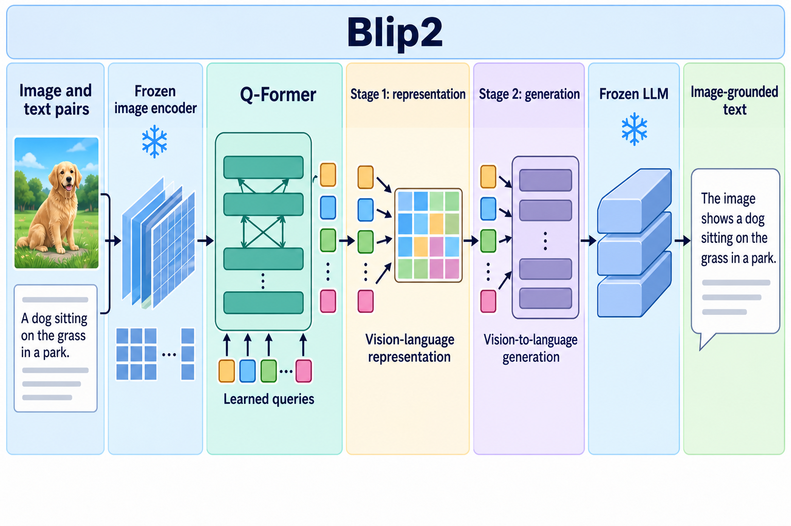

# BLIP-2: Bootstrapping Language-Image Pre-training with Frozen Image Encoders and Large Language Models

- **大类**：多模态与基础表征 (`multimodal-foundation`)
- **来源**：[ICML 2023](https://proceedings.mlr.press/v202/li23q.html)
- **参考切入点**：method overview and two-stage Q-Former pretraining
- **核心图意**：A lightweight Querying Transformer bridges a frozen image encoder and a frozen language model through two distinct pretraining stages.
- **完整生产 prompt**：[prompt.txt](prompt.txt)（21,928 个非空白字符）
- **低空白筛查**：通过；内容网格占用 89.8%，最大连续空区 10.0%
- **人工目视检查**：通过

这是依据论文机制重新组织的 ImageGen 概念示意，不是论文原图、实验结果或人工 gold。生成时未输入原论文图像像素。使用时应借鉴信息组织、对象密度、分区和连线方式，并依据目标论文重新核验科学关系。
