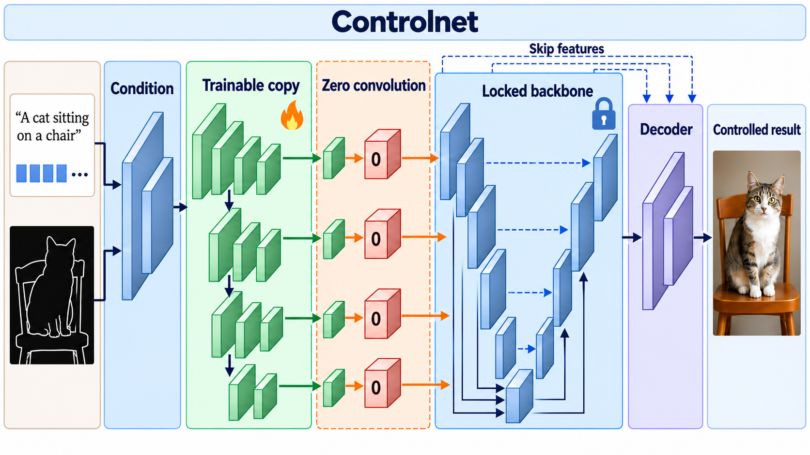

# Adding Conditional Control to Text-to-Image Diffusion Models

- **大类**：生成建模与可控编辑 (`generative-control`)
- **来源**：[ICCV 2023](https://openaccess.thecvf.com/content/ICCV2023/html/Zhang_Adding_Conditional_Control_to_Text-to-Image_Diffusion_Models_ICCV_2023_paper.html)
- **参考切入点**：locked backbone, trainable copy and zero convolutions
- **核心图意**：A trainable copy of a locked diffusion encoder receives spatial controls and connects through zero convolutions without disrupting the pretrained backbone at initialization.
- **完整生产 prompt**：[prompt.txt](prompt.txt)（22,700 个非空白字符）
- **低空白筛查**：通过；内容网格占用 98.3%，最大连续空区 1.2%
- **人工目视检查**：通过

这是依据论文机制重新组织的 ImageGen 概念示意，不是论文原图、实验结果或人工 gold。生成时未输入原论文图像像素。使用时应借鉴信息组织、对象密度、分区和连线方式，并依据目标论文重新核验科学关系。
