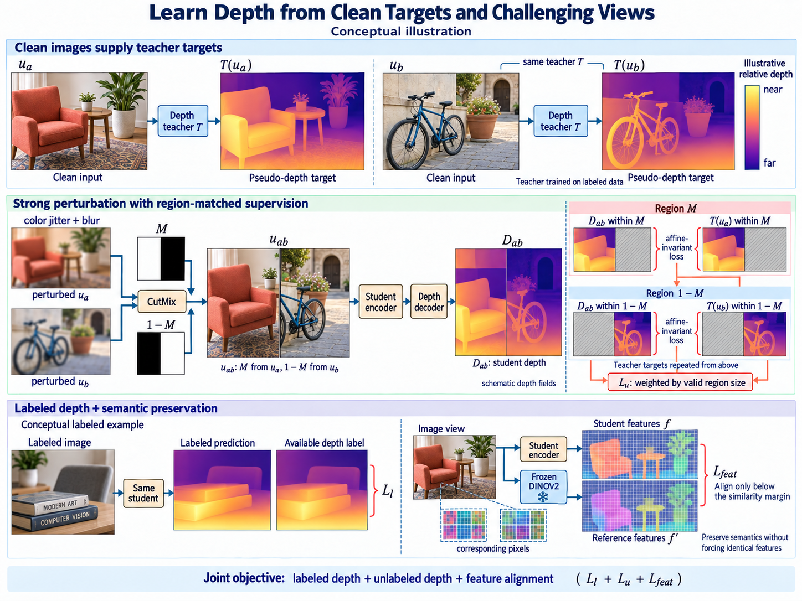

# Depth Anything: Unleashing the Power of Large-Scale Unlabeled Data

- **大类**：检测、分割与密集预测 (`detection-segmentation`)
- **来源论文**：[Depth Anything: Unleashing the Power of Large-Scale Unlabeled Data](https://openaccess.thecvf.com/content/CVPR2024/html/Yang_Depth_Anything_Unleashing_the_Power_of_Large-Scale_Unlabeled_Data_CVPR_2024_paper.html)
- **会议 / 年份**：CVPR 2024
- **完整生产 prompt**：[prompt.txt](prompt.txt)（26,411 个非空白字符）
- **低空白筛查**：通过；内容网格占用 92.3%，最大连续空区 1.4%
- **质量沿革**：[quality-history.json](quality-history.json)

这是论文启发的学习 / 开发概念图，不是论文原图、实验结果或人工 gold。来源家族及其衍生物须排除在未来封闭评测之外；使用时应依据目标论文逐项核验科学关系。
