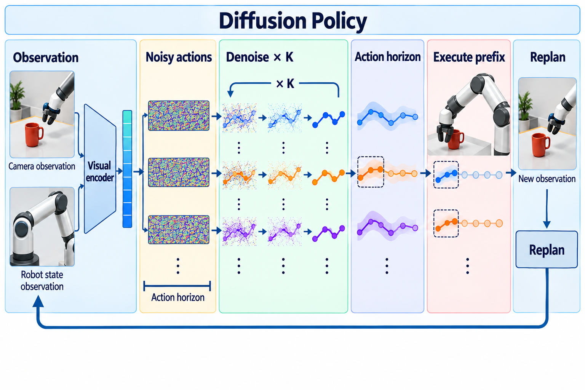

# Diffusion Policy: Visuomotor Policy Learning via Action Diffusion

- **大类**：时序、图学习、世界模型与机器人 (`structured-robotics`)
- **来源**：[RSS 2023](https://roboticsproceedings.org/rss19/p026.html)
- **参考切入点**：Figure 1 policy representations and receding-horizon diffusion control
- **核心图意**：A conditional action-score model iteratively denoises a multimodal action sequence from noise, then receding-horizon control executes only the leading actions and replans from new observations.
- **完整生产 prompt**：[prompt.txt](prompt.txt)（22,856 个非空白字符）
- **低空白筛查**：通过；内容网格占用 89.7%，最大连续空区 10.0%
- **人工目视检查**：通过

这是依据论文机制重新组织的 ImageGen 概念示意，不是论文原图、实验结果或人工 gold。生成时未输入原论文图像像素。使用时应借鉴信息组织、对象密度、分区和连线方式，并依据目标论文重新核验科学关系。
