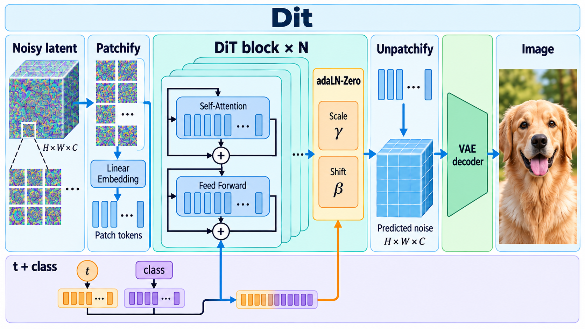

# Scalable Diffusion Models with Transformers

- **大类**：生成建模与可控编辑 (`generative-control`)
- **来源**：[ICCV 2023](https://openaccess.thecvf.com/content/ICCV2023/html/Peebles_Scalable_Diffusion_Models_with_Transformers_ICCV_2023_paper.html)
- **参考切入点**：Diffusion Transformer block variants
- **核心图意**：A transformer processes patches of noisy latent inputs, with timestep and class conditioning modulating repeated DiT blocks before latent decoding.
- **完整生产 prompt**：[prompt.txt](prompt.txt)（22,716 个非空白字符）
- **低空白筛查**：通过；内容网格占用 100.0%，最大连续空区 0.0%
- **人工目视检查**：通过

这是依据论文机制重新组织的 ImageGen 概念示意，不是论文原图、实验结果或人工 gold。生成时未输入原论文图像像素。使用时应借鉴信息组织、对象密度、分区和连线方式，并依据目标论文重新核验科学关系。
