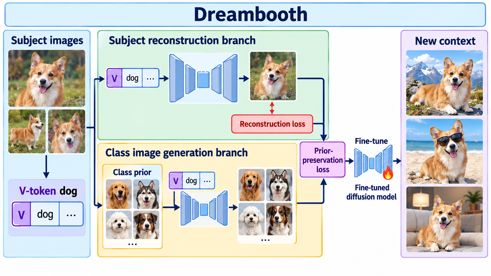

# DreamBooth: Fine Tuning Text-to-Image Diffusion Models for Subject-Driven Generation

- **大类**：生成建模与可控编辑 (`generative-control`)
- **来源**：[CVPR 2023](https://openaccess.thecvf.com/content/CVPR2023/html/Ruiz_DreamBooth_Fine_Tuning_Text-to-Image_Diffusion_Models_for_Subject-Driven_Generation_CVPR_2023_paper.html)
- **参考切入点**：subject binding and prior-preservation training
- **核心图意**：A rare identifier binds a few subject images to a pretrained diffusion model while class-specific prior preservation protects diversity.
- **完整生产 prompt**：[prompt.txt](prompt.txt)（21,926 个非空白字符）
- **低空白筛查**：通过；内容网格占用 91.6%，最大连续空区 5.0%
- **人工目视检查**：通过

这是依据论文机制重新组织的 ImageGen 概念示意，不是论文原图、实验结果或人工 gold。生成时未输入原论文图像像素。使用时应借鉴信息组织、对象密度、分区和连线方式，并依据目标论文重新核验科学关系。
