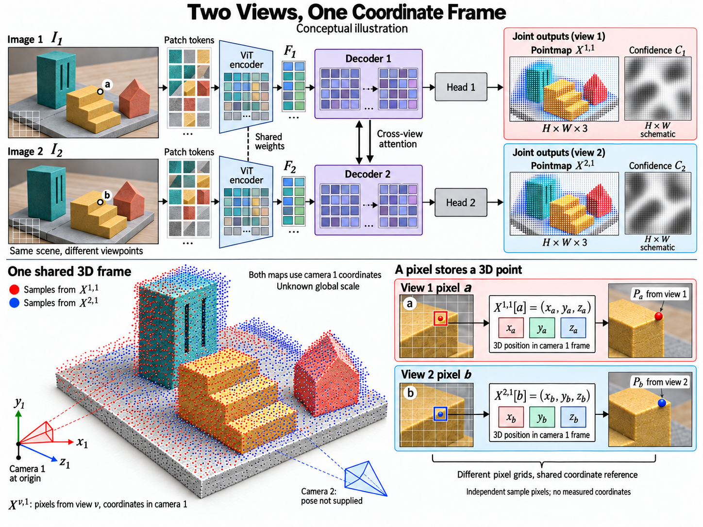

# DUSt3R: Geometric 3D Vision Made Easy

- **大类**：三维表示、重建与分子空间 (`three-d-reconstruction`)
- **来源论文**：[DUSt3R: Geometric 3D Vision Made Easy](https://openaccess.thecvf.com/content/CVPR2024/html/Wang_DUSt3R_Geometric_3D_Vision_Made_Easy_CVPR_2024_paper.html)
- **会议 / 年份**：CVPR 2024
- **完整生产 prompt**：[prompt.txt](prompt.txt)（26,537 个非空白字符）
- **低空白筛查**：通过；内容网格占用 90.5%，最大连续空区 0.9%
- **质量沿革**：[quality-history.json](quality-history.json)

这是论文启发的学习 / 开发概念图，不是论文原图、实验结果或人工 gold。来源家族及其衍生物须排除在未来封闭评测之外；使用时应依据目标论文逐项核验科学关系。
