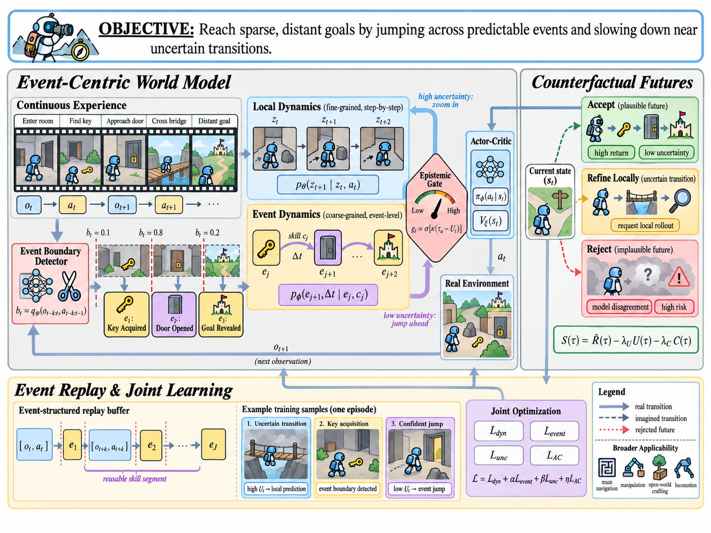

# EventBridge-RL · 双时间尺度世界模型

[完整生成 prompt](prompt.txt) · [查看原尺寸成图](figure.png) · [返回知识库](../../README.md)

## 生成记录

- 工具：内置 ImageGen；生成日期：2026-09-08。
- 状态：生成示例，尚未获得用户最终视觉确认。
- 来源：[gatina 提供的原始收藏](../../references/kb01-eventbridge-rl.png)。
- 提示词：收藏内 prompt 的完整校对整理版，修复 OCR 断词、标签与数学符号，保留具体场景和布局要求；`prompt.txt` 保存本页成图使用的完整生成输入。
- 输入方式：文本生成，无附加参考图片。
- 风格标签：数学机制 / 分支场景 / 强化学习。

## 值得借鉴

- 把抽象的两种时间尺度画成连续小状态与跨事件长弧线，视觉对象直接解释差异。
- 主方法区与较窄的反事实分支区配合，下方回放与优化形成完整闭环。
- 为观察、事件、不确定性、可接受未来分配固定颜色，公式紧邻对应模块。

## 观察与迁移

本次成图的主体层次、环境片段与三条未来分支清晰。生成图补入的边界概率只是示意，不能当作真实测量；迁移时还需核对门控方向、数学下标与闭环连线。

来源与许可参见[知识库说明](../../README.md#使用边界与许可)。若改出更好的版本，欢迎连同完整 prompt、对应成图和修改理由一起[投稿](../../CONTRIBUTING.md)。
