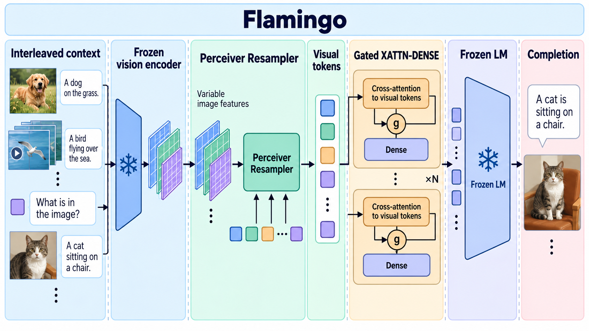

# Flamingo: a Visual Language Model for Few-Shot Learning

- **大类**：多模态与基础表征 (`multimodal-foundation`)
- **来源**：[NeurIPS 2022](https://proceedings.neurips.cc/paper_files/paper/2022/hash/960a172bc7fbf0177ccccbb411a7d800-Abstract-Conference.html)
- **参考切入点**：Perceiver Resampler and gated cross-attention architecture
- **核心图意**：A Perceiver Resampler compresses variable visual inputs into tokens injected through gated cross-attention layers of a frozen language model.
- **完整生产 prompt**：[prompt.txt](prompt.txt)（21,845 个非空白字符）
- **低空白筛查**：通过；内容网格占用 99.8%，最大连续空区 0.2%
- **人工目视检查**：通过

这是依据论文机制重新组织的 ImageGen 概念示意，不是论文原图、实验结果或人工 gold。生成时未输入原论文图像像素。使用时应借鉴信息组织、对象密度、分区和连线方式，并依据目标论文重新核验科学关系。
