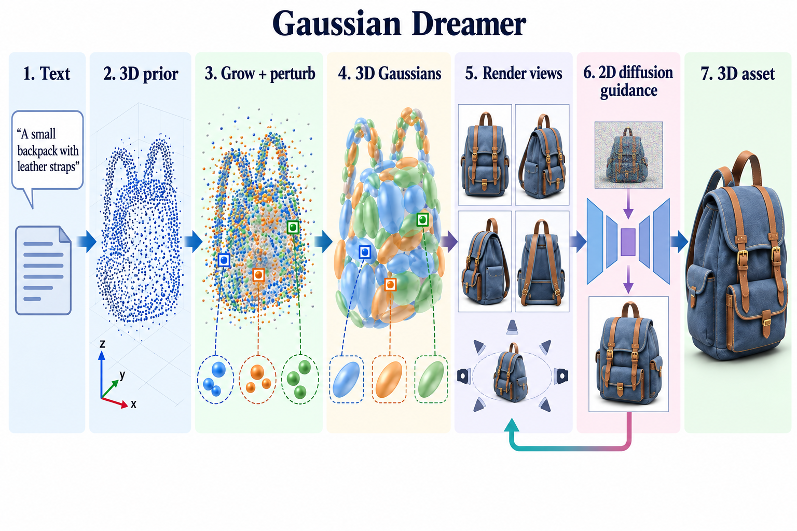

# GaussianDreamer: Fast Generation from Text to 3D Gaussians by Bridging 2D and 3D Diffusion Models

- **大类**：三维表示、重建与分子空间 (`three-d-reconstruction`)
- **来源**：[CVPR 2024](https://openaccess.thecvf.com/content/CVPR2024/html/Yi_GaussianDreamer_Fast_Generation_from_Text_to_3D_Gaussians_by_Bridging_CVPR_2024_paper.html)
- **参考切入点**：3D prior initialization and 2D diffusion refinement
- **核心图意**：A text-conditioned 3D diffusion prior initializes Gaussian geometry, then 2D diffusion guidance refines appearance through differentiable Gaussian rendering.
- **完整生产 prompt**：[prompt.txt](prompt.txt)（21,642 个非空白字符）
- **低空白筛查**：通过；内容网格占用 82.8%，最大连续空区 10.0%
- **人工目视检查**：通过

这是依据论文机制重新组织的 ImageGen 概念示意，不是论文原图、实验结果或人工 gold。生成时未输入原论文图像像素。使用时应借鉴信息组织、对象密度、分区和连线方式，并依据目标论文重新核验科学关系。
