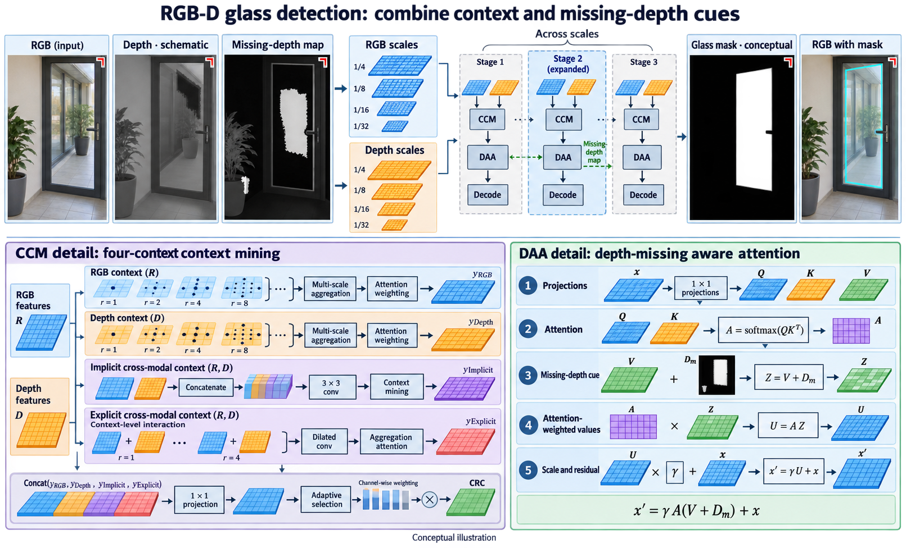

# Leveraging RGB-D Data with Cross-Modal Context Mining for Glass Surface Detection

- **大类**：生成建模与可控编辑 (`generative-control`)
- **来源论文**：[Leveraging RGB-D Data with Cross-Modal Context Mining for Glass Surface Detection](https://ojs.aaai.org/index.php/AAAI/article/view/32558)
- **会议 / 年份**：AAAI 2025
- **完整生产 prompt**：[prompt.txt](prompt.txt)（22,424 个非空白字符）
- **低空白筛查**：通过；内容网格占用 100.0%，最大连续空区 0.0%
- **质量沿革**：[quality-history.json](quality-history.json)

这是论文启发的学习 / 开发概念图，不是论文原图、实验结果或人工 gold。来源家族及其衍生物须排除在未来封闭评测之外；使用时应依据目标论文逐项核验科学关系。
