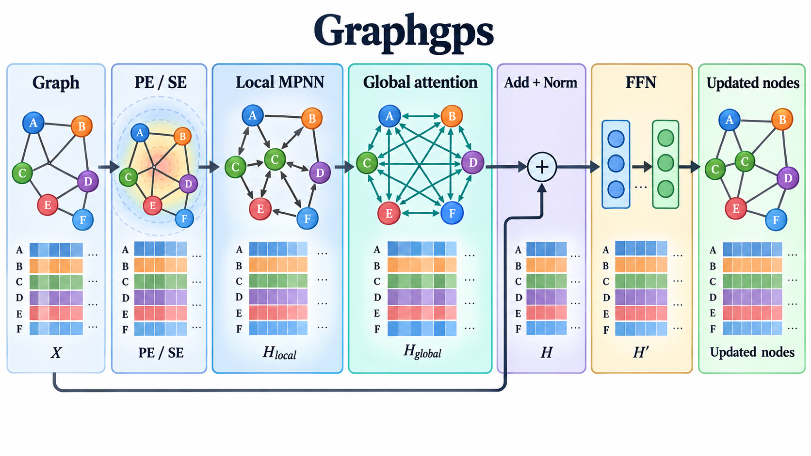

# Recipe for a General, Powerful, Scalable Graph Transformer

- **大类**：时序、图学习、世界模型与机器人 (`structured-robotics`)
- **来源**：[NeurIPS 2022](https://proceedings.neurips.cc/paper_files/paper/2022/hash/5d4834a159f1547b267a05a4e2b7cf5e-Abstract-Conference.html)
- **参考切入点**：GraphGPS layer recipe
- **核心图意**：Positional or structural encodings feed a layer that combines local message passing and global attention before a feed-forward update, retaining linear-scale variants.
- **完整生产 prompt**：[prompt.txt](prompt.txt)（20,406 个非空白字符）
- **低空白筛查**：通过；内容网格占用 80.6%，最大连续空区 10.0%
- **人工目视检查**：通过

这是依据论文机制重新组织的 ImageGen 概念示意，不是论文原图、实验结果或人工 gold。生成时未输入原论文图像像素。使用时应借鉴信息组织、对象密度、分区和连线方式，并依据目标论文重新核验科学关系。
