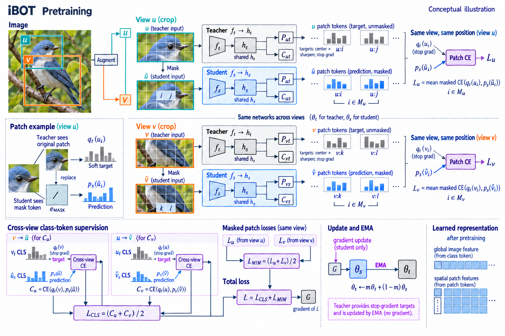

# Image BERT Pre-training with Online Tokenizer

- **大类**：多模态与基础表征 (`multimodal-foundation`)
- **来源论文**：[Image BERT Pre-training with Online Tokenizer](https://iclr.cc/virtual/2022/papers.html)
- **会议 / 年份**：ICLR 2022
- **完整生产 prompt**：[prompt.txt](prompt.txt)（23,338 个非空白字符）
- **低空白筛查**：通过；内容网格占用 84.4%，最大连续空区 2.2%
- **质量沿革**：[quality-history.json](quality-history.json)

这是论文启发的学习 / 开发概念图，不是论文原图、实验结果或人工 gold。来源家族及其衍生物须排除在未来封闭评测之外；使用时应依据目标论文逐项核验科学关系。
