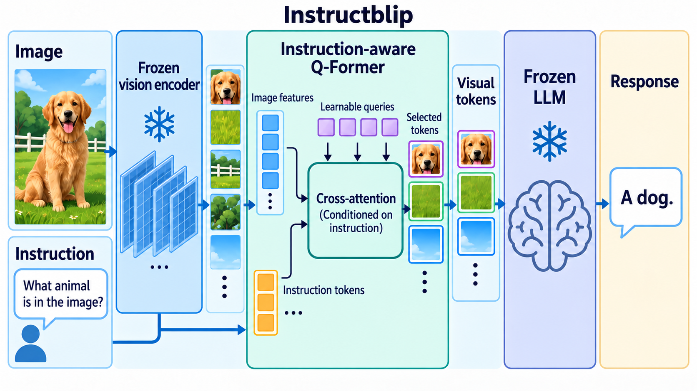

# InstructBLIP: Towards General-purpose Vision-Language Models with Instruction Tuning

- **大类**：多模态与基础表征 (`multimodal-foundation`)
- **来源**：[NeurIPS 2023](https://proceedings.neurips.cc/paper_files/paper/2023/hash/9a6a435e75419a836fe47ab6793623e6-Abstract-Conference.html)
- **参考切入点**：instruction-aware Q-Former overview
- **核心图意**：An instruction-aware Query Transformer selects visual evidence conditioned on the instruction before a frozen language model answers.
- **完整生产 prompt**：[prompt.txt](prompt.txt)（22,536 个非空白字符）
- **低空白筛查**：通过；内容网格占用 96.1%，最大连续空区 2.0%
- **人工目视检查**：通过

这是依据论文机制重新组织的 ImageGen 概念示意，不是论文原图、实验结果或人工 gold。生成时未输入原论文图像像素。使用时应借鉴信息组织、对象密度、分区和连线方式，并依据目标论文重新核验科学关系。
