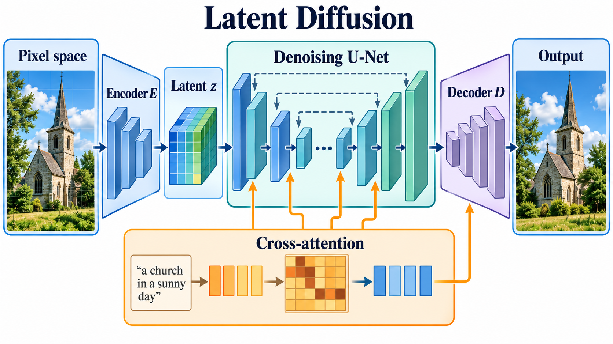

# High-Resolution Image Synthesis with Latent Diffusion Models

- **大类**：生成建模与可控编辑 (`generative-control`)
- **来源**：[CVPR 2022](https://openaccess.thecvf.com/content/CVPR2022/html/Rombach_High-Resolution_Image_Synthesis_With_Latent_Diffusion_Models_CVPR_2022_paper.html)
- **参考切入点**：latent diffusion architecture
- **核心图意**：Perceptual compression moves diffusion from pixels into a lower-dimensional latent space while cross-attention injects flexible conditioning.
- **完整生产 prompt**：[prompt.txt](prompt.txt)（21,011 个非空白字符）
- **低空白筛查**：通过；内容网格占用 80.0%，最大连续空区 6.6%
- **人工目视检查**：通过

这是依据论文机制重新组织的 ImageGen 概念示意，不是论文原图、实验结果或人工 gold。生成时未输入原论文图像像素。使用时应借鉴信息组织、对象密度、分区和连线方式，并依据目标论文重新核验科学关系。
