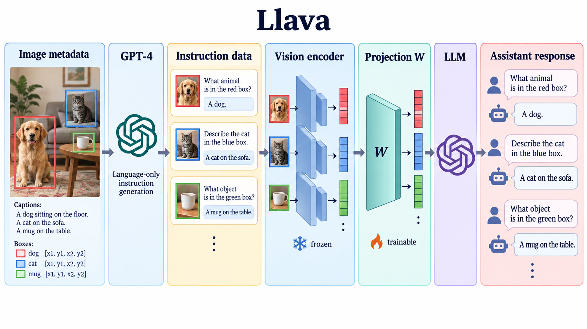

# Visual Instruction Tuning

- **大类**：多模态与基础表征 (`multimodal-foundation`)
- **来源**：[NeurIPS 2023](https://proceedings.neurips.cc/paper_files/paper/2023/file/6dcf277ea32ce3288914faf369fe6de0-Paper-Conference.pdf)
- **参考切入点**：visual instruction data generation and LLaVA architecture
- **核心图意**：Language-only GPT-4 converts image captions and boxes into visual instructions, then a projection connects a vision encoder to an LLM for instruction tuning.
- **完整生产 prompt**：[prompt.txt](prompt.txt)（20,410 个非空白字符）
- **低空白筛查**：通过；内容网格占用 81.2%，最大连续空区 10.0%
- **人工目视检查**：通过

这是依据论文机制重新组织的 ImageGen 概念示意，不是论文原图、实验结果或人工 gold。生成时未输入原论文图像像素。使用时应借鉴信息组织、对象密度、分区和连线方式，并依据目标论文重新核验科学关系。
