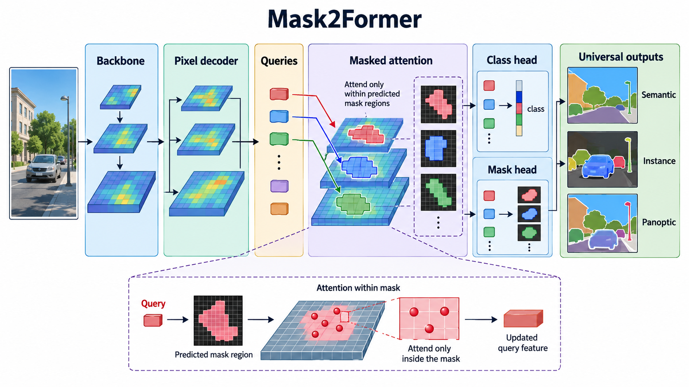

# Masked-Attention Mask Transformer for Universal Image Segmentation

- **大类**：检测、分割与密集预测 (`detection-segmentation`)
- **来源**：[CVPR 2022](https://openaccess.thecvf.com/content/CVPR2022/html/Cheng_Masked-Attention_Mask_Transformer_for_Universal_Image_Segmentation_CVPR_2022_paper.html)
- **参考切入点**：masked-attention decoder architecture
- **核心图意**：Queries attend only within predicted mask regions across a multiscale pixel decoder, yielding one architecture for semantic, instance and panoptic segmentation.
- **完整生产 prompt**：[prompt.txt](prompt.txt)（20,269 个非空白字符）
- **低空白筛查**：通过；内容网格占用 80.8%，最大连续空区 4.7%
- **人工目视检查**：通过

这是依据论文机制重新组织的 ImageGen 概念示意，不是论文原图、实验结果或人工 gold。生成时未输入原论文图像像素。使用时应借鉴信息组织、对象密度、分区和连线方式，并依据目标论文重新核验科学关系。
