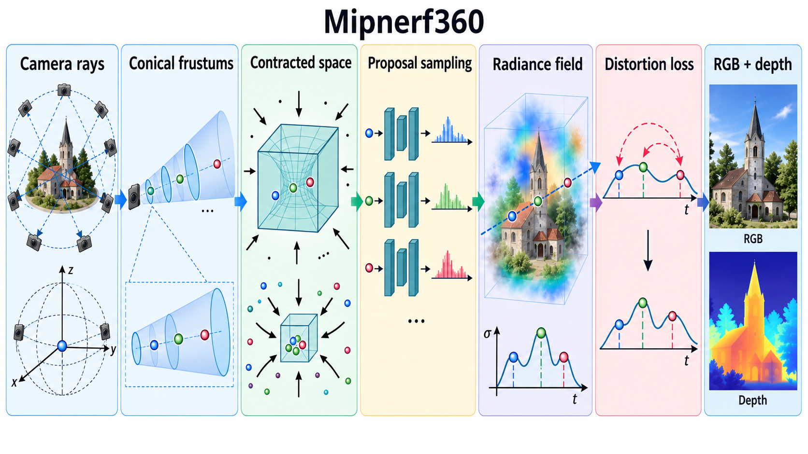

# Mip-NeRF 360: Unbounded Anti-Aliased Neural Radiance Fields

- **大类**：三维表示、重建与分子空间 (`three-d-reconstruction`)
- **来源**：[CVPR 2022](https://openaccess.thecvf.com/content/CVPR2022/html/Barron_Mip-NeRF_360_Unbounded_Anti-Aliased_Neural_Radiance_Fields_CVPR_2022_paper.html)
- **参考切入点**：contracted coordinates, proposal sampling and distortion regularization
- **核心图意**：Scene contraction maps unbounded space into a bounded domain while proposal sampling and distortion regularization allocate detail efficiently along conical frustums.
- **完整生产 prompt**：[prompt.txt](prompt.txt)（21,358 个非空白字符）
- **低空白筛查**：通过；内容网格占用 91.2%，最大连续空区 5.0%
- **人工目视检查**：通过

这是依据论文机制重新组织的 ImageGen 概念示意，不是论文原图、实验结果或人工 gold。生成时未输入原论文图像像素。使用时应借鉴信息组织、对象密度、分区和连线方式，并依据目标论文重新核验科学关系。
