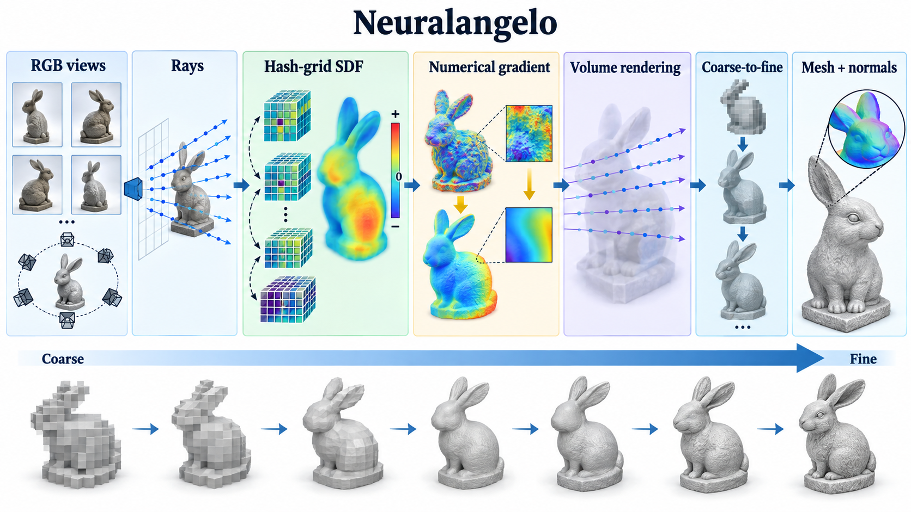

# Neuralangelo: High-Fidelity Neural Surface Reconstruction

- **大类**：三维表示、重建与分子空间 (`three-d-reconstruction`)
- **来源**：[CVPR 2023](https://openaccess.thecvf.com/content/CVPR2023/html/Li_Neuralangelo_High-Fidelity_Neural_Surface_Reconstruction_CVPR_2023_paper.html)
- **参考切入点**：multiresolution hash grid and numerical-gradient reconstruction
- **核心图意**：Numerical gradients smooth high-order derivatives while coarse-to-fine activation of multiresolution hash grids progressively reveals high-fidelity surfaces from RGB views.
- **完整生产 prompt**：[prompt.txt](prompt.txt)（20,509 个非空白字符）
- **低空白筛查**：通过；内容网格占用 89.7%，最大连续空区 1.9%
- **人工目视检查**：通过

这是依据论文机制重新组织的 ImageGen 概念示意，不是论文原图、实验结果或人工 gold。生成时未输入原论文图像像素。使用时应借鉴信息组织、对象密度、分区和连线方式，并依据目标论文重新核验科学关系。
