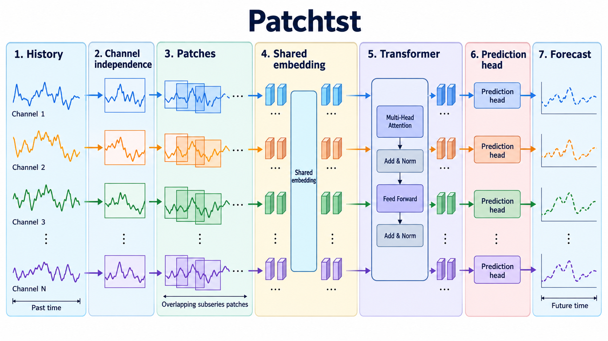

# A Time Series is Worth 64 Words: Long-term Forecasting with Transformers

- **大类**：时序、图学习、世界模型与机器人 (`structured-robotics`)
- **来源**：[ICLR 2023](https://openreview.net/pdf?id=Jbdc0vTOcol)
- **参考切入点**：channel-independent patch Transformer
- **核心图意**：Each time-series channel is segmented into subseries patches, embedded as tokens and processed by shared Transformer weights while preserving channel independence.
- **完整生产 prompt**：[prompt.txt](prompt.txt)（20,469 个非空白字符）
- **低空白筛查**：通过；内容网格占用 93.3%，最大连续空区 3.1%
- **人工目视检查**：通过

这是依据论文机制重新组织的 ImageGen 概念示意，不是论文原图、实验结果或人工 gold。生成时未输入原论文图像像素。使用时应借鉴信息组织、对象密度、分区和连线方式，并依据目标论文重新核验科学关系。
