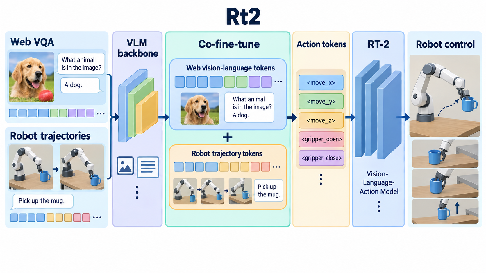

# RT-2: Vision-Language-Action Models Transfer Web Knowledge to Robotic Control

- **大类**：时序、图学习、世界模型与机器人 (`structured-robotics`)
- **来源**：[CoRL 2023](https://proceedings.mlr.press/v229/zitkovich23a)
- **参考切入点**：co-fine-tuning web and robot data as token sequences
- **核心图意**：Web-scale vision-language examples and robot trajectories are co-fine-tuned in one token interface by expressing discretized robot actions as text tokens.
- **完整生产 prompt**：[prompt.txt](prompt.txt)（20,402 个非空白字符）
- **低空白筛查**：通过；内容网格占用 84.8%，最大连续空区 10.0%
- **人工目视检查**：通过

这是依据论文机制重新组织的 ImageGen 概念示意，不是论文原图、实验结果或人工 gold。生成时未输入原论文图像像素。使用时应借鉴信息组织、对象密度、分区和连线方式，并依据目标论文重新核验科学关系。
