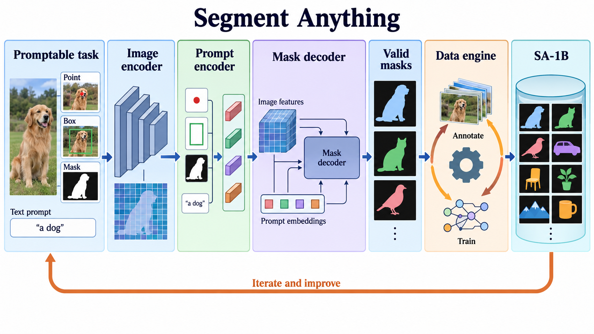

# Segment Anything

- **大类**：检测、分割与密集预测 (`detection-segmentation`)
- **来源**：[ICCV 2023](https://openaccess.thecvf.com/content/ICCV2023/html/Kirillov_Segment_Anything_ICCV_2023_paper.html)
- **参考切入点**：Figure 1 task-model-data loop
- **核心图意**：A promptable segmentation task, a modular model and an iterative data engine reinforce one another to produce transferable masks and a billion-mask dataset.
- **完整生产 prompt**：[prompt.txt](prompt.txt)（20,022 个非空白字符）
- **低空白筛查**：通过；内容网格占用 81.7%，最大连续空区 10.0%
- **人工目视检查**：通过

这是依据论文机制重新组织的 ImageGen 概念示意，不是论文原图、实验结果或人工 gold。生成时未输入原论文图像像素。使用时应借鉴信息组织、对象密度、分区和连线方式，并依据目标论文重新核验科学关系。
