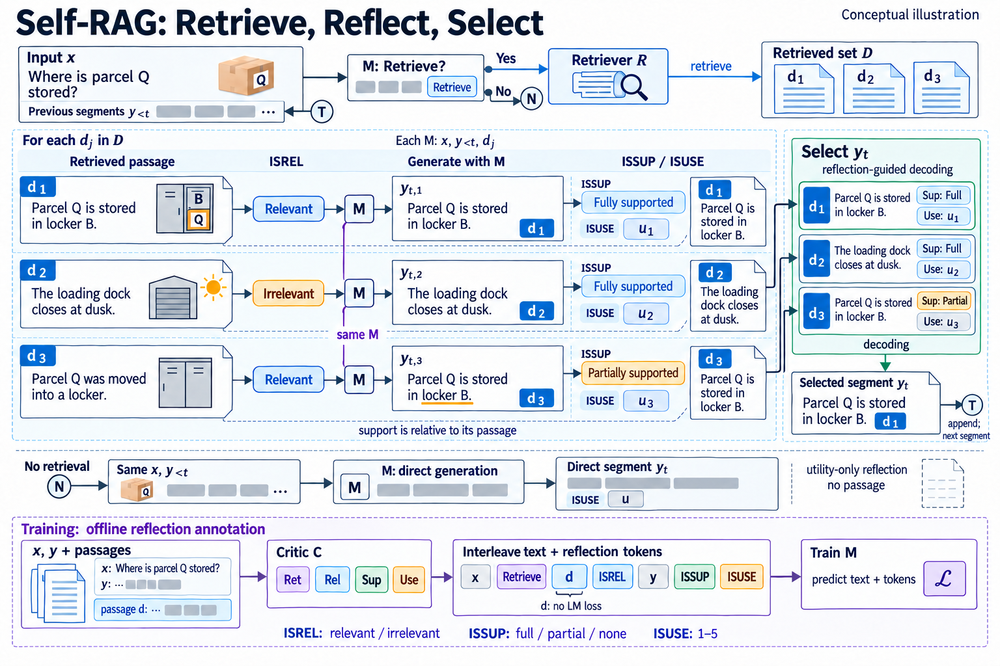

# Self-RAG: Learning to Retrieve, Generate, and Critique through Self-Reflection

- **大类**：智能体、工具使用与推理 (`agents-reasoning`)
- **来源论文**：[Self-RAG: Learning to Retrieve, Generate, and Critique through Self-Reflection](https://proceedings.iclr.cc/paper_files/paper/2024/hash/25f7be9694d7b32d5cc670927b8091e1-Abstract-Conference.html)
- **会议 / 年份**：ICLR 2024
- **完整生产 prompt**：[prompt.txt](prompt.txt)（23,710 个非空白字符）
- **低空白筛查**：通过；内容网格占用 95.0%，最大连续空区 1.2%
- **质量沿革**：[quality-history.json](quality-history.json)

这是论文启发的学习 / 开发概念图，不是论文原图、实验结果或人工 gold。来源家族及其衍生物须排除在未来封闭评测之外；使用时应依据目标论文逐项核验科学关系。
