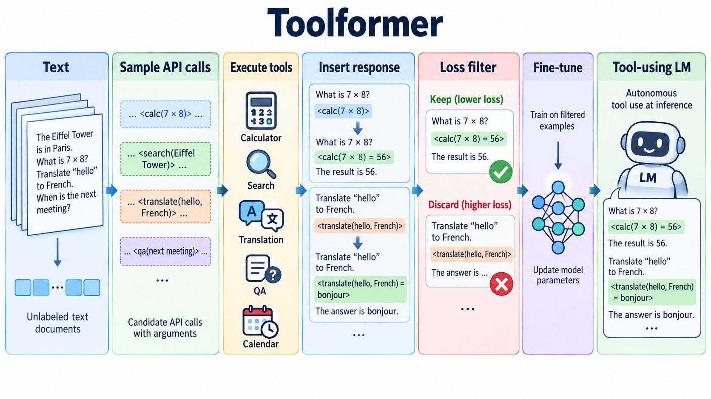

# Toolformer: Language Models Can Teach Themselves to Use Tools

- **大类**：智能体、工具使用与推理 (`agents-reasoning`)
- **来源**：[NeurIPS 2023](https://proceedings.neurips.cc/paper/2023/hash/d842425e4bf79ba039352da0f658a906-Abstract-Conference.html)
- **参考切入点**：self-supervised API-call insertion and filtering pipeline
- **核心图意**：A language model samples candidate API calls, executes them and retains only calls that reduce language-model loss, producing its own tool-use training data.
- **完整生产 prompt**：[prompt.txt](prompt.txt)（20,729 个非空白字符）
- **低空白筛查**：通过；内容网格占用 87.5%，最大连续空区 5.0%
- **人工目视检查**：通过

这是依据论文机制重新组织的 ImageGen 概念示意，不是论文原图、实验结果或人工 gold。生成时未输入原论文图像像素。使用时应借鉴信息组织、对象密度、分区和连线方式，并依据目标论文重新核验科学关系。
