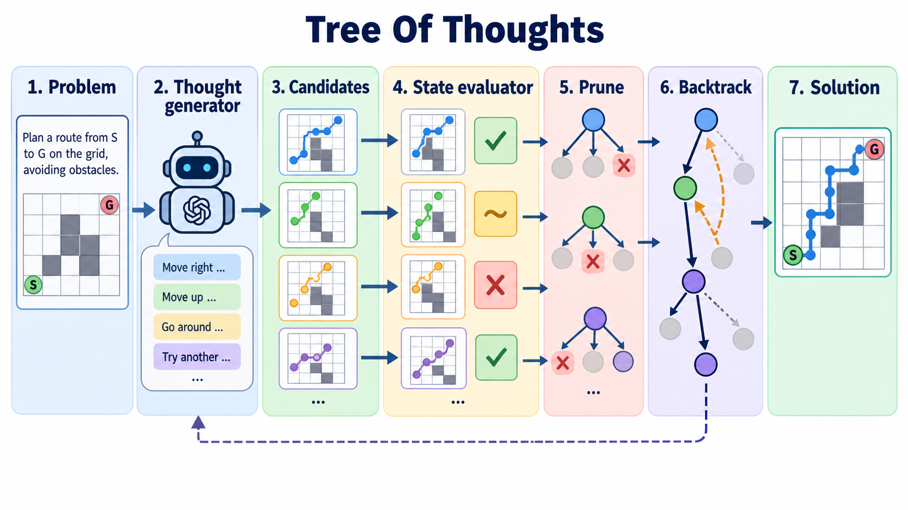

# Tree of Thoughts: Deliberate Problem Solving with Large Language Models

- **大类**：智能体、工具使用与推理 (`agents-reasoning`)
- **来源**：[NeurIPS 2023](https://proceedings.neurips.cc/paper_files/paper/2023/hash/271db9922b8d1f4dd7aaef84ed5ac703-Abstract.html)
- **参考切入点**：Figure 1 comparison of IO, CoT, self-consistency and ToT
- **核心图意**：Thought decomposition, state evaluation and search allow a language model to explore, prune and backtrack over multiple reasoning paths instead of committing left to right.
- **完整生产 prompt**：[prompt.txt](prompt.txt)（20,284 个非空白字符）
- **低空白筛查**：通过；内容网格占用 81.2%，最大连续空区 10.0%
- **人工目视检查**：通过

这是依据论文机制重新组织的 ImageGen 概念示意，不是论文原图、实验结果或人工 gold。生成时未输入原论文图像像素。使用时应借鉴信息组织、对象密度、分区和连线方式，并依据目标论文重新核验科学关系。
