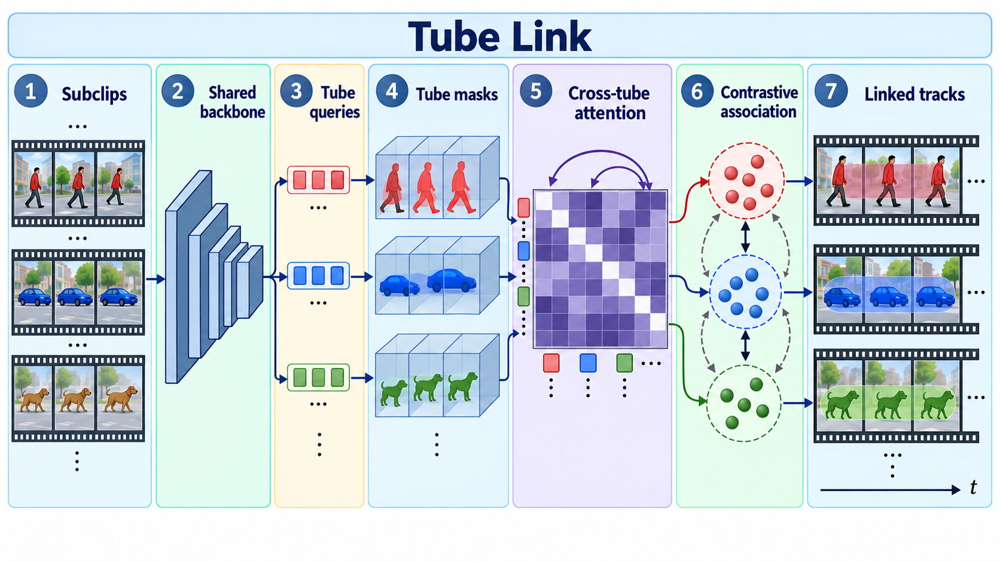

# Tube-Link: A Flexible Cross Tube Framework for Universal Video Segmentation

- **大类**：检测、分割与密集预测 (`detection-segmentation`)
- **来源**：[ICCV 2023](https://openaccess.thecvf.com/content/ICCV2023/html/Li_Tube-Link_A_Flexible_Cross_Tube_Framework_for_Universal_Video_Segmentation_ICCV_2023_paper.html)
- **参考切入点**：short-subclip tube prediction and cross-tube association
- **核心图意**：Short subclips yield tube masks that are linked through query-level cross-tube attention and temporal contrastive features for long-video segmentation.
- **完整生产 prompt**：[prompt.txt](prompt.txt)（22,006 个非空白字符）
- **低空白筛查**：通过；内容网格占用 95.0%，最大连续空区 5.0%
- **人工目视检查**：通过

这是依据论文机制重新组织的 ImageGen 概念示意，不是论文原图、实验结果或人工 gold。生成时未输入原论文图像像素。使用时应借鉴信息组织、对象密度、分区和连线方式，并依据目标论文重新核验科学关系。
