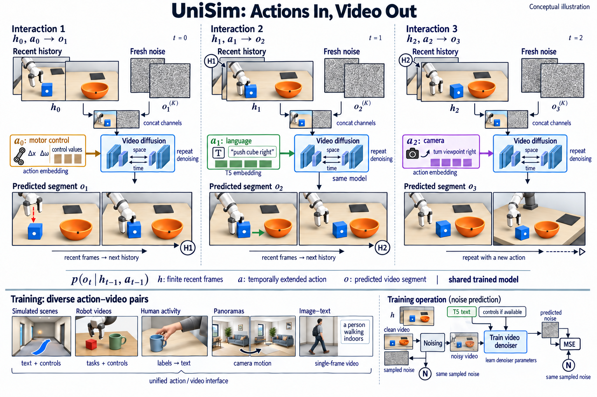

# Learning Interactive Real-World Simulators

- **大类**：时序、图学习、世界模型与机器人 (`structured-robotics`)
- **来源论文**：[Learning Interactive Real-World Simulators](https://proceedings.iclr.cc/paper_files/paper/2024/hash/c4d66eae503694424123b93ac0fbaf17-Abstract-Conference.html)
- **会议 / 年份**：ICLR 2024
- **完整生产 prompt**：[prompt.txt](prompt.txt)（26,657 个非空白字符）
- **低空白筛查**：通过；内容网格占用 86.6%，最大连续空区 1.9%
- **质量沿革**：[quality-history.json](quality-history.json)

这是论文启发的学习 / 开发概念图，不是论文原图、实验结果或人工 gold。来源家族及其衍生物须排除在未来封闭评测之外；使用时应依据目标论文逐项核验科学关系。
