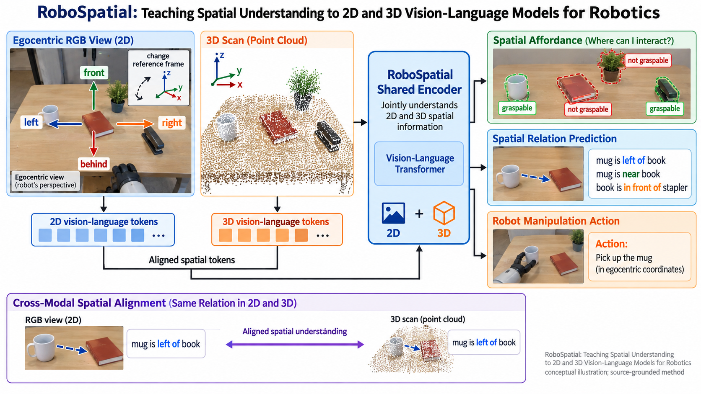

# RoboSpatial: Teaching Spatial Understanding to 2D and 3D Vision-Language Models for Robotics

状态：**已由用户选定，作为近期知识库扩充条目发布**。

分类：世界模型与具身感知 / World models and embodied perception

来源：[RoboSpatial: Teaching Spatial Understanding to 2D and 3D Vision-Language Models for Robotics](https://openaccess.thecvf.com/content/CVPR2025/html/Song_RoboSpatial_Teaching_Spatial_Understanding_to_2D_and_3D_Vision-Language_Models_CVPR_2025_paper.html)，CVPR 2025。

[完整 prompt](prompt.txt) · [选定清单](../selected-ledger.json)

这是一张基于论文方法结构的概念性科研插图，不是实验结果、性能证据或人类金标准。来源论文家族及其衍生物排除在未来封闭评测之外。

Prompt 字符数：2709；非空白字符数：2329。
