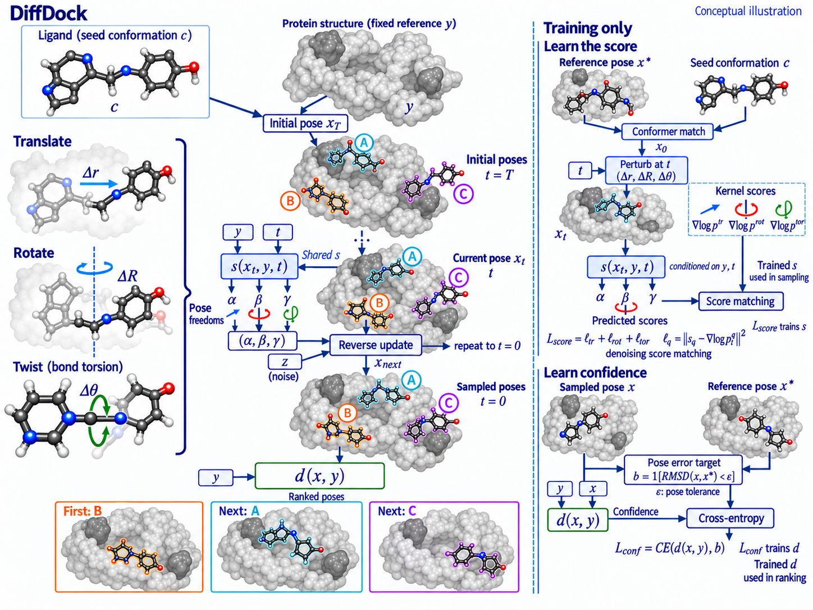

# DiffDock

状态：**已认可历史参考**。

来源：[DiffDock: Diffusion Steps, Twists, and Turns for Molecular Docking](https://iclr.cc/virtual/2023/papers.html) — ICLR 2023。

[查看原图](figure.png) · [完整实际提交 prompt](prompt.txt) · [来源与校验信息](metadata.json)

完整 prompt：23,963 个非空白字符。图片为生成概念插图。
