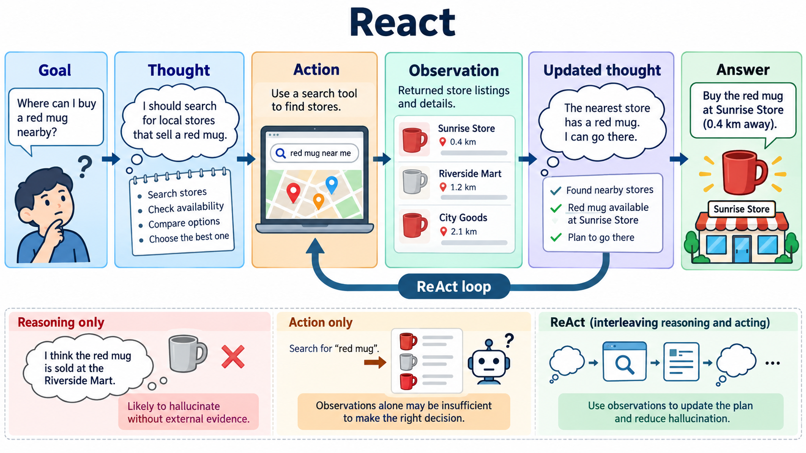

# ReAct

状态：**已认可历史参考**。

来源：[ReAct: Synergizing Reasoning and Acting in Language Models](https://openreview.net/pdf?id=WE_vluYUL-X) — ICLR 2023。

[查看原图](figure.png) · [完整实际提交 prompt](prompt.txt) · [来源与校验信息](metadata.json)

完整 prompt：20,426 个非空白字符。图片为生成概念插图。
