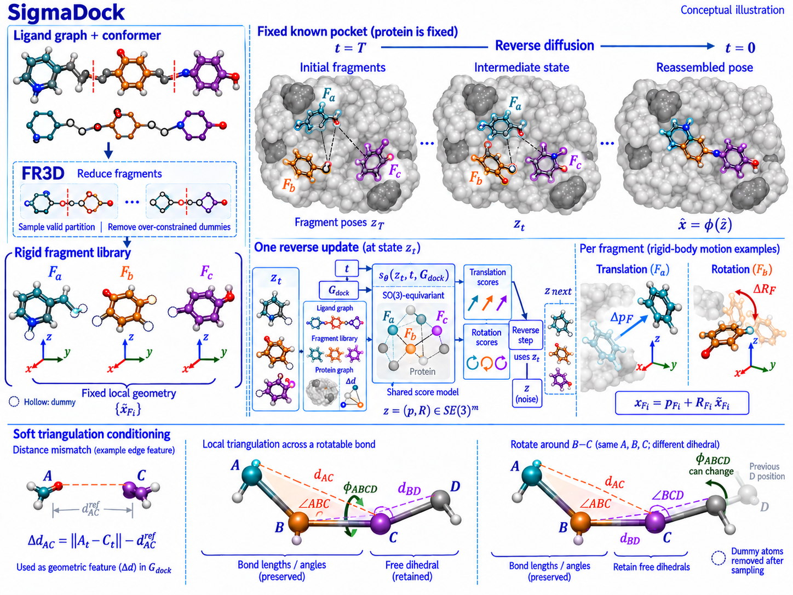

# SigmaDock

状态：**待审阅草图，未纳入已认可参考池**。

来源：[SigmaDock: Untwisting Molecular Docking with Fragment-Based SE(3) Diffusion](https://proceedings.iclr.cc/paper_files/paper/2026/hash/4c1516dc8f1643c94d164a436ce8fe51-Abstract-Conference.html) — ICLR 2026。

[查看原图](figure.png) · [完整实际提交 prompt](prompt.txt) · [来源与校验信息](metadata.json)

完整 prompt：25,096 个非空白字符。图片为生成概念插图。

[实际生成时使用的输入参考图](reference.png)。完整 prompt 与输出、输入参考图均保留原始字节。

仍需审阅：

- Small angle-label artifacts remain in the lower construction; publication typography needs another precision pass.
- Generic molecular graphics were not validated as a chemical structure.
